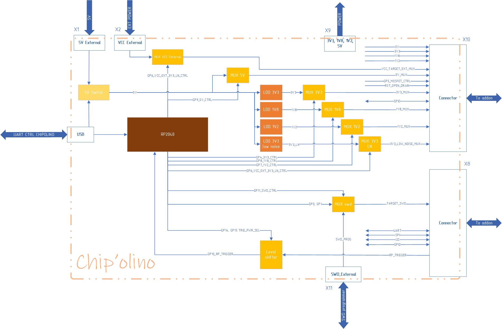

# Chip'olino: [The Playbook](The_Playbook/Chipolino_The_Playbook.md)

Chip'olino - программно-аппаратный комплекс для проведения glitch-атак по питанию. В него входит основная плата Chip'olino и набор аддонов для различных микроконтроллеров.
Chip'olino решает две основные задачи:
* Проведение уже известных атак по питанию на микроконтроллеры;
* Исследование и эксперименты в области атак по питанию.

### Targets
Сейчас в проекте реализованы алгоритмы для проведения атак на:
* [nRF52](The_Playbook/nRF52.md)
* [Renesas (RH850)](The_Playbook/Renesas.md)
* [NXP (LPC214x, LPC134x)](The_Playbook/NXP.md)
* [STM32 (F401/F411)](The_Playbook/STM32.md)

Помимо основных алгоритмов в репозитории присутствуют вспомогательные скрипты: для блокировки тестовых чипов, вычитывания прошивок, стираний чипа, определения текущего уровня защиты.


###### Note
В Chip'olino имплементированы алгоритмы для разблокировки большого количества чипов, но все же это не убирает необходимость читать документацию и подробно разбираться в происходящем. Нужно понимать и как устроена защита целевого МК, и как происходит атака. Тема атак по питанию сложная и интересная, нюансов много.

Ниже приведена функциональная схема данного устройства.



Для проведения атаки на МК, его нужно выпаять и запаять на готовый аддон, который можно подключать к основной плате. Такой подход позволяет хорошо зафиксировать временные параметры атаки и сильно повышает повторяемость атаки.

### Features
* Возможность использовать внешнее питание (0-5V, 100mA) для проведения атак, если недостаточно представленных на плате. Так, например, для некоторых чипов лучше использовать пониженное напряжение питания вместо 3.3В, указанных в документации на чип. В таком случае можно подключить лабораторный блок питания в разъем X2 (External target supply) и поэкспериментировать.
* SWD реализованный в Chip'olino. Для атак на NRF52, STM32 и другие чипы иногда необходимо быстро взаимодействовать с МК через SWD. Обычно в сетап добавляют внешний программатор (как J-Link), но такой вариант сильно замедляет перебор из-за прослойки драйверов USB. В Chip'olino есть модуль реализующий SWD на PIO. Скорость перебора возрастает в сотню раз.
* Мультиплексор для SWD позволяет подключаться к аддону как через встроенный SWD интерфейс, так и через внешний отладчик, подключенный в разъем X11. Это удобно для быстрого подключения программатора после атаки.
* Наличие различных источников питания, а также возможность управлять ими.
* Возможность подключать внешние 5 вольт для питания всего устройства. Это позволяет нивелировать влияние различных помех.
* Наличие универсального аддона для подключения и тестирования на любой плате.
* Набор вспомогательных скриптов для МК.

###### Note
Все величины смещений и ширин импульсов для сбоя, приведенные в инструкции, указаны для тактовой частоты RP2040 250 MHz.

### Files

```
.
├── The_Playbook
│   └── Chipolino_The_Playbook.md    # Chip'olino Playbook 
├── fw                               # Chip'olino firmware project 
│   ├── includes
│   ├── pio_sm
│   └── targets
├── pcb                              # PCB projects
│   ├── ChipOlino_revA               # Chip'olino PCB project
│   ├── Nordic                       # Nordic addons PCB
│   │   ├── nRF52840-QIAA
│   │   └── nRF52833-QDAA
│   ├── NXP                          # NXP addons PCB
│   │   └── LPC2148FBD64_revA
│   ├── STM                          # STM addons PCB
│   │   └── STM32F411CCU_revA
│   ├── Renesas                      # Renesas addons PCB
│   │   └── RH850_F1L_revB   
│   ├── template_addon_revA          # template addon project
│   └── universal_addon_revA         # universal addon project
├── scripts                           
│   ├── check_ssr_rh850.py    
│   ├── chipctrl.py                  # Chip'olino control script (main for use)
│   ├── chipolino.py                 # class for Chip'olino board 
│   ├── dump_rh850.py                
│   ├── dump_stm32.py                
│   ├── erase_lpc2148.py             
│   ├── erase_rh850.py               
│   ├── requirements.txt             # pip install -r requirements.txt
│   └── test_erase_stm32.py          
└── ...
```

### Quick start

1) Установить все необходимые пакеты
```
pip install -r ./scripts/requirements.txt
```
2) Читать [The Playbook](The_Playbook/Chipolino_The_Playbook.md)