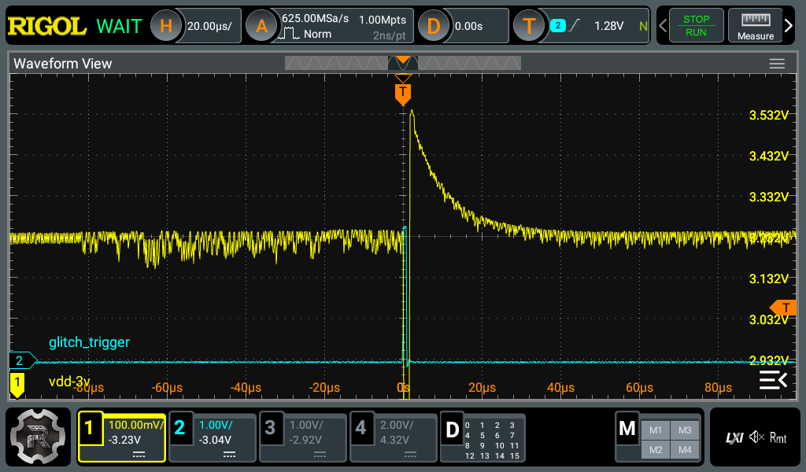
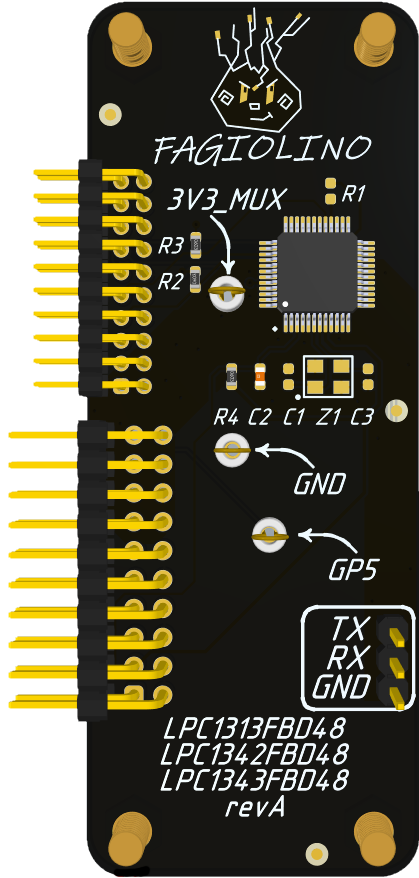
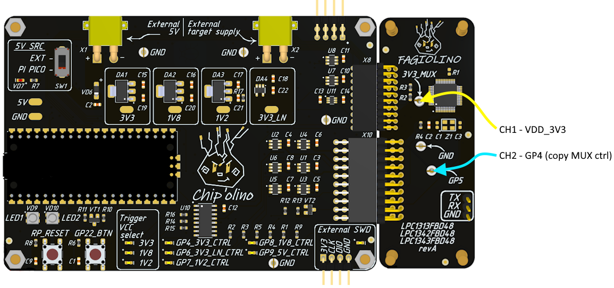
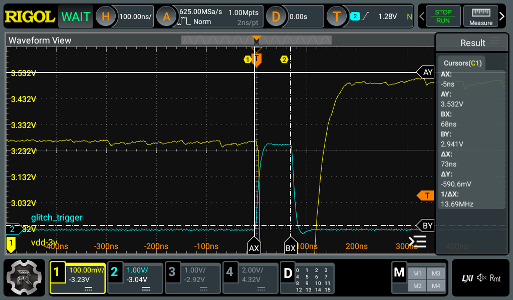

# NXP

### Supported devices

The repository includes descriptions of attacks on LPC microcontrollers. The most detailed analysis is written for [LPC2148](#lpc2148), which you should definitely review.
* [LPC2148](#lpc2148)
* [LPC1343](#lpc1343)
* ...
* Any similar LPC — using a universal addon.

## <span id="lpc2148">LPC2148</span>

<details>
  <summary>Addon LPC2148</summary>
  


</details>

### Bypass CRP1, CRP2

LPC2148 has several levels of protection. The current protection level is determined by the value stored in flash memory at address 0x1FC. This chapter covers bypassing protection levels CRP1 and CRP2. In both modes, debugging via JTAG is disabled, as well as certain commands executable by the bootloader.


This MCU always starts with the bootloader. The bootloader code checks the value at address 0x1FC and configures the MCU accordingly. One of these checks is located just before the MCU enters ISP mode. This check is the target of the attack. The goal is to get into ISP mode while making the MCU believe that no protection is enabled.


##### Note
```
You can dump the bootloader from the LPC2148, perform reverse engineering, and visually locate this check. 
The bootloader is located in memory from 0x7FFFD000 to 0x80000000.
```

Before performing the attack, make sure that one of the target protection levels—CRP1 or CRP2—is enabled. To do this, connect the addon to Chip'olino and start the attack. Chip'olino will power up the microcontroller and attempt to synchronize with the bootloader.


```bash
py.exe chipctrl.py -p COM6 -g -t lpc2148 -o 255800 270100 -w 275 295
```

If the glitching process starts as a result, it means the MCU is in CRP1 or CRP2 mode. Make sure the message "Target synchronized" appears.


##### Debug note
```
"Target not synchronized" значит, что нет связи с МК. Проблема может быть в сборке аддона или же в том, что установлен уровень защиты CRP3.
```

For preliminary training on a test MCU, you can conveniently set the protection via JTAG. Use the J-Mem utility together with J-Link. Connect the addon to Chip'olino, and then connect J-Link to the addon, as shown below.


To supply the required power to the MCU and prepare it for JTAG connection, you can run the attack script. If no protection is set, the script will simply power on the MCU. After that, you can connect via J-Link in the usual way. Write **0x12345678** or **0x87654321** to address 0x1FC to enable the protection.


#### Glitch MCU
For this MCU, the attack moment is during the bootloader code execution—that is, the time when the MCU boots up before any interaction with it. Then, the MCU loads into ISP mode and either responds to read commands or returns an error (if the glitch was unsuccessful). The attack itself is performed through the MCU's power line. The 3.3V power supply to the MCU passes through a multiplexer on the Chip'olino board, allowing the power line to be switched to ground at the moment of the attack. After attempting the glitch, Chip'olino will try to synchronize with the LPC2148 and request several bytes from the flash memory to verify whether the attack succeeded.


##### Note
```
A 12 MHz quartz crystal resonator is required for the MCU to operate, even in ISP (bootloader) mode.
```


Starting the attack on **LPC2148**:

```bash
py.exe chipctrl.py -p COM5 -g -t lpc2148 -o 255500 270100 -w 275 295
```


The message "LOCK" in the **Log** field means that the attack is proceeding correctly.

If you are using Chip'olino together with the addon, you can simply run the script as shown above. The offset and pulse width parameters won’t change much. If something doesn’t work out, below are oscilloscope screenshots of a successful attack. You can compare the signal shapes and timing parameters, then fine-tune the offset and duration accordingly.

Carefully study the screenshots. They can be a great help if you encounter any problems.





###### Glitch parameters
* ~110 µs from the MCU start (hardware initialization on the screenshot);
* ~83 µs from the start of bootloader execution (bootloader exec start on the screenshot);
* ~1.2 µs pulse duration;
* Method: multiplexer on the MCU power line (3.3V).


#### Dump firmware
After a successful attack, do not disconnect the addon from Chip'olino, so it will remain powered and ready for communication via UART. It’s best to connect the USB-UART adapter to the addon and PC before starting the attack. The firmware is stored in the flash memory, and its size depends on the MCU — you need to study the memory map of your MCU in advance.


For the LPC2148, you need to dump the memory region from 0x00000000 to 0x00080000. There is a script for this: _**/scripts/dump_lpc2148.py**_. Run it as shown below, making sure to specify the port corresponding to your USB-UART adapter.

```bash
# Dump of the LPC2148 flash memory region to the file **flash_lpc2148.bin**
py.exe .\dump_lpc2148.py -p COM8 -a 0 0x00080000 -f flash_lpc2148.bin
```

Memory dumping via UART is not the fastest procedure. This can be avoided. You can read only the 0th sector via UART, then erase just the 0th sector (using _**/scripts/erase_lpc2148.py**_). After that, the protection on the MCU will be removed since the value that determines the protection level is located at address 0x1FC (within the 0th sector). The remaining part of the firmware can then be read via JTAG.


```bash
# Dump the 0th memory sector of the LPC2148 into the file zero_sector.bin
py.exe .\dump_lpc2148.py -p COM8 -a 0 0x1000 -f zero_sector.bin

# Once the 0th sector is read, it can be erased
py .\erase_lpc2148.py -p COM8
```


All the actions described above should be done without disconnecting the addon from Chip'olino. After erasing the 0th sector, the chip needs to be rebooted once. This can be done with the following commands:

```bash
# Power off the MCU
py.exe chipctrl.py -p COM5 -gp 4 0
# Power on the MCU
py.exe chipctrl.py -p COM5 -gp 4 1
```

After reboot, JTAG should work.
#### Links
* https://www.nxp.com/docs/en/user-guide/UM10139.pdf
* https://recon.cx/2017/brussels/resources/slides/RECON-BRX-2017-Breaking_CRP_on_NXP_LPC_Microcontrollers_slides.pdf

## <span id="lpc1343">LPC1343</span>

The attack on LPC1343 is similar to the one for LPC2148, with a few differences:
- Slightly different UART packet format — so different scripts are used;    
- SWD interface instead of JTAG.    
Otherwise, there are no major differences. That’s why the detailed explanation is given only for LPC2148 — it’s best to read that first before moving on to LPC1343.

<details>
  <summary>Addon LPC1343</summary>
  



</details>

### Bypass CRP1, CRP2
#### Glitch MCU





Starting the attack on LPC1343:

```bash
py.exe chipctrl.py -p COM6 -g -t lpc1343 -o 15300 190100 -w 14 20
```


The message "LOCK" in the **Log** field means that the attack is proceeding correctly.

You can compare both the signal shapes and timing parameters, then fine-tune the offset and pulse duration accordingly. Carefully study the screenshots — they can be extremely helpful if any issues arise.




###### Glitch parameters
* ~65 µs from MCU start;
* ~55 µs from bootloader execution start;
* ~75 ns pulse duration;
* Method: multiplexer on the MCU’s 3.3V power line.
#### Dump firmware
After a successful attack, do not disconnect the addon from Chip'olino—this way it will remain powered and ready for communication via UART. It’s best to connect the USB-UART adapter to both the addon and the PC before starting the attack. The firmware is located in the flash memory; its size depends on the microcontroller (MCU), so you should first study the memory map of your specific MCU.

```bash
# Dump the flash memory region of the LPC1343 to the file flash_lpc1343.bin
py.exe .\dump_lpc1343.py -p COM8 -a 0 0x8000 -f flash_lpc1343.bin
```

Dumping memory via UART is not the fastest procedure. This can be avoided. You can read only the 0th sector via UART, then erase only the 0th sector (_**/scripts/erase_lpc1343.py**_). After that, the protection on the MCU will be removed because the value that defines the protection level is located at address 0x1FC (in the 0th sector). The remaining part of the firmware can then be read via SWD.


```bash
# Dump the 0th sector of LPC1343 memory to the file zero_sector.bin
py.exe .\dump_lpc1343.py -p COM8 -a 0 0x1000 -f zero_sector.bin

# Once the 0th sector is read, it can be erased
py .\erase_lpc1343.py -p COM8
```


All the actions mentioned above should be performed without disconnecting the addon from Chip'olino. After erasing the 0th sector, the chip will need to be rebooted once. This can be done with the following commands:

```bash
# Power off MCU
py.exe chipctrl.py -p COM5 -gp 4 0
# Power on MCU
py.exe chipctrl.py -p COM5 -gp 4 1

# Switch the SWD pins from the MCU to the connector for external connection
py.exe chipctrl.py -p COM6 -swd ext
```

After the reboot, SWD should be functional.


#### Links
* https://www.nxp.com/docs/en/user-guide/UM10139.pdf
* https://recon.cx/2017/brussels/resources/slides/RECON-BRX-2017-Breaking_CRP_on_NXP_LPC_Microcontrollers_slides.pdf