# RK3588
## Bypass secure boot using power fault injection on Orange Pi 5 Plus

### Vulnerability description 

##### Note
```
This SoC has more than one BootROM. If Secure Boot is enabled, the Secure BootROM is executed instead. Therefore, to prepare the attack, we first need to dump and analyze it. This is where the Secure Boot algorithms are implemented.
```

For the attack, we used an Orange Pi 5 Plus board with an onboard SPI Flash. Booting from SPI Flash is more convenient for research than booting from eMMC. The vulnerability is also present when booting from eMMC, but boards with this configuration are relatively rare.

The SoC boot process works as follows:

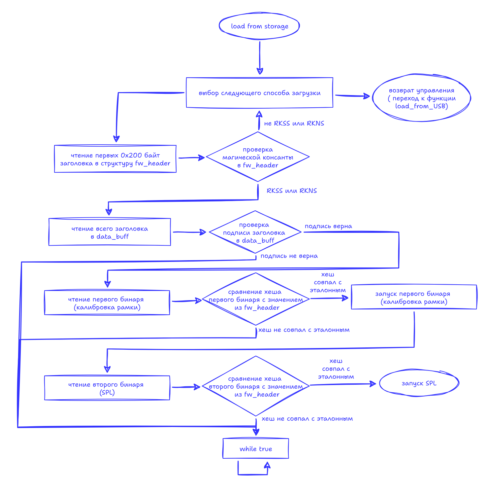

- Load the header into memory (contains hashes for DDR training and SPL)
- Verify the header signature
- Load the DDR training binary into memory
- Verify the DDR training hash
- Execute DDR training
- Load the SPL binary into memory
- Verify the SPL hash
- Execute SPL
- And so on...

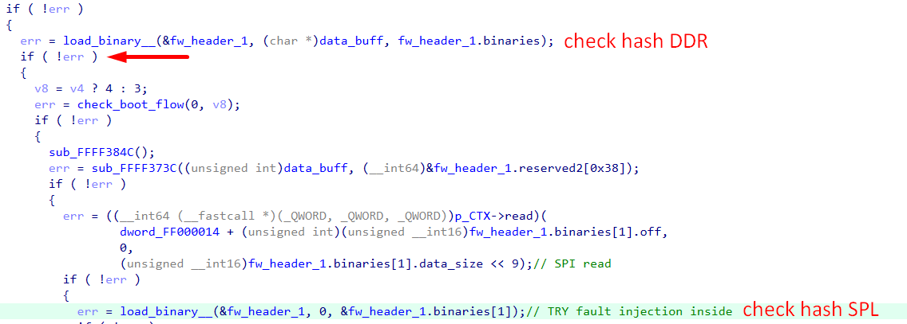

**A suitable point for the attack:** the hash verification of the SPL or DDR training. In this case, there is no need to modify the header or change any of its data. It is sufficient to patch the binary as needed, and if the glitch is successful, the code will be executed:

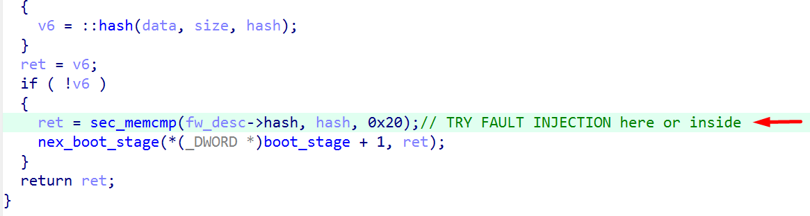

### Preparation Orange PCB
The first step is preparing the test setup. Usually, for each new microcontroller, we build a small board — an add-on with the minimum necessary circuitry. This significantly simplifies tuning the attack parameters and makes the attack reproducible on other similar MCUs.

In this case, the SoC is large and complex, making it difficult to build a dedicated board for it. We wanted to get this optional task done quickly. So, for the first time in a long while, we deviated from our usual approach and decided to perform the attack directly on the device — specifically, on an Orange Pi board.

After reviewing the SoC documentation and the Orange Pi schematics, it became clear that the attack most likely needed to target the `VDD_CPU_LIT_S0` power line. LIT stands for _little_, referring to the little core. This is the core that executes the BootROM code we need to glitch.

Another indication that the BootROM runs on “little” core 0 is its first instruction: `MRS X0, MPIDR_EL1`. This instruction reads the `MPIDR_EL1` system register into the X0 register. The code then checks whether execution is taking place on core 0; if not, it gets stuck in a `while (true)` loop.

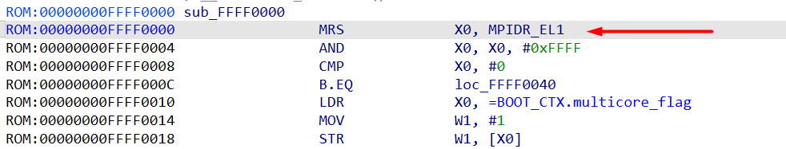

In addition, analyzing the schematic revealed several other important details:
- the presence and number of capacitors on the core power rail (not that we didn’t expect them)
- the maximum current the core power supply can deliver — 5 A

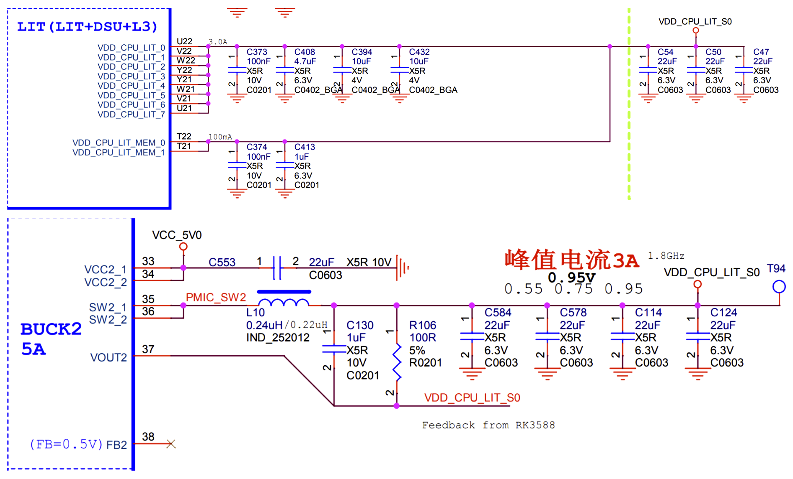

All capacitors on the `VDD_CPU_LIT_S0` line were identified and removed from the board. The SoC boots normally without them, although this is not always the case. Often, several capacitors need to be left in place for the chip to operate properly, even though they make it harder to pull the core voltage down sharply.

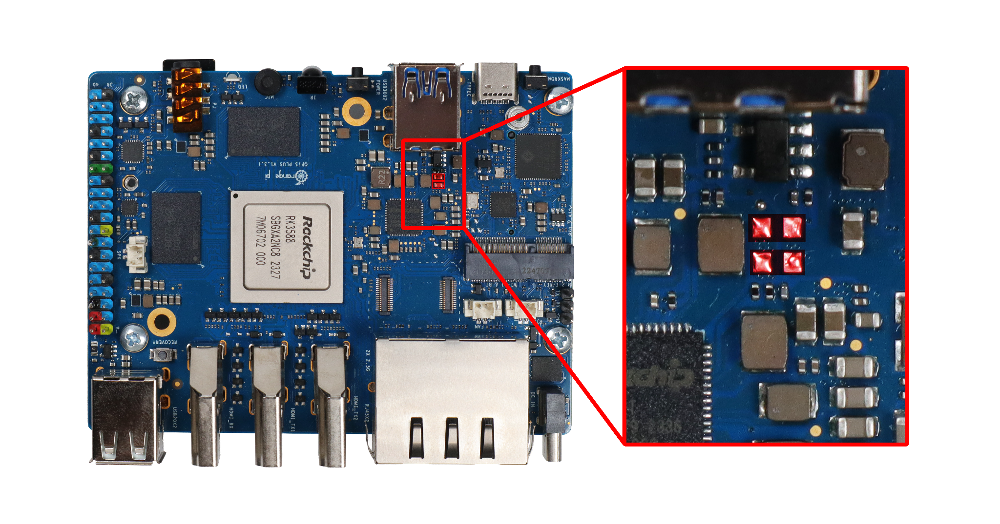

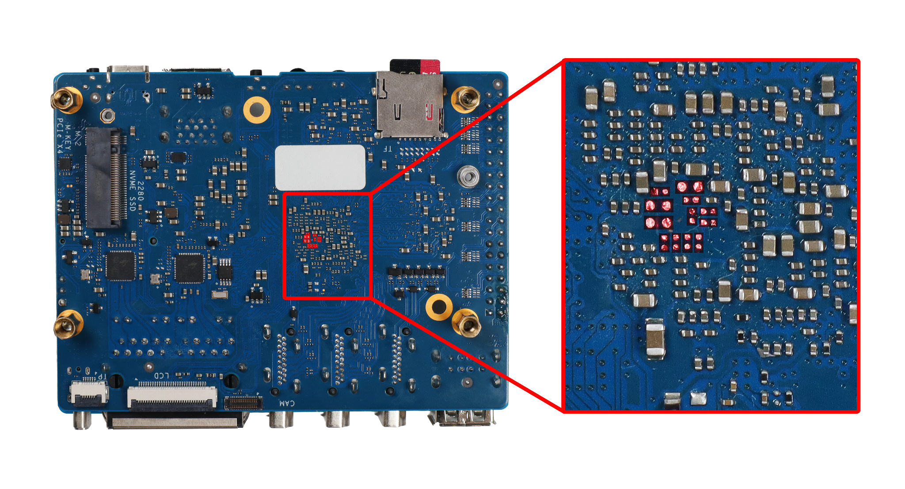

The fact that the DC/DC converter can deliver a high current means that a powerful transistor with a dedicated driver is required to control it. After all, the shape and duration of the pulse are among the key factors determining the success of the attack.

As a result, in addition to Chipolino, we built an external transistor module based on this schematic. Here’s what we got:

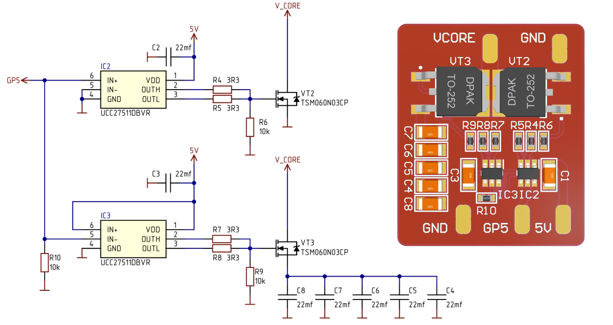

The module requires a 5 V power supply and a connection to common GND, while the control input is connected to Chipolino.

An important factor in achieving the steepest possible pulse waveform is minimizing the resistance of the connection between the module and the SoC core power inputs. Therefore, the module is mounted on the back side of the board, as close as possible to the SoC pins, and a thick wire is used to connect it to Vcore.


### Glitch SoC

As the attack platform, we use Chipolino and, in this case, a universal add-on for convenient connection to the Orange Pi and the driver. It looks like this:

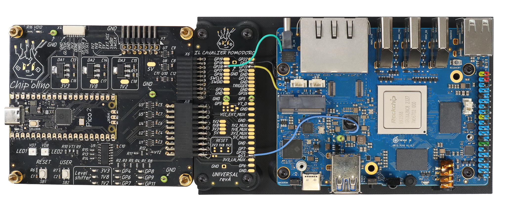
Connection table:

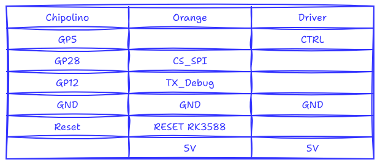

##### Note
```
Orange debug serial port parameters: 1500000 8N1.
```

This board boots from SPI Flash. This means that the BootROM looks for the header and SPL there. For this reason, we designed the attack logic around the data exchange on the SPI interface. If we look at the boot log:

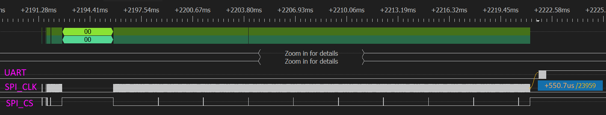

we can note the following:

- The approximate point at which control is transferred to the DDR module can be determined from the messages it starts sending over UART.
- The DDR module starts approximately 550 µs after the end of its read from SPI Flash.
- The CS (chip select) line is toggled 17 times from reset assertion until the end of the DDR module read.

All of this suggests that we can synchronize the attack with the CS line and count its edges until the DDR module has finished loading. This should allow us to get as close as possible to the point at which the DDR binary hash is verified. Of course, some fine-tuning of the attack timing will still be required, but it is clear that there is no point searching beyond 550 µs after the end of the read — by that time, the module has already started executing.

Thus, we have established the attack logic and reduced the timing search window to 550 µs, which is very small in our experience.

So, here is the plan:

- Start the Orange Pi using the reset signal (connected to Chipolino).
- Wait for 17 edges on the CS line (connected to Chipolino's GP28).
- Glitch Vcore line.
- Wait for messages from the modified DDR module over UART.
- If the messages are received, the attack was successful and the code has started executing. If not, repeat steps 1–5 with a different attack timing.
- The End.

So, we enable Secure Boot and boot a correctly signed image to study the system's behavior. We then patch the DDR module. As soon as this image was written to the SPI Flash, the SoC stopped booting normally and the UART messages disappeared, meaning the system was ready for the Power Glitch attack.

Following the plan described above, we implemented the attack algorithm in Chipolino. Essentially, our experiments resulted in several parameters that define a successful attack. Here they are:
###### Command
```bash
py.exe chipctrl.py -p COM5 -g -t rk3588 -o 135435 135450 -w 250 280
```

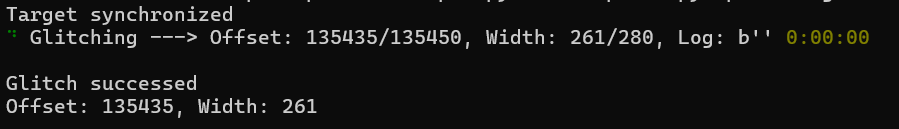

###### Glitch parameters
* ~1 us pulse duration;
* ~540 µs after the last edge on the CS line during the DDR module read
* Method: N-MOSFET driver on the VDD_CPU_LIT_SO (core power line)

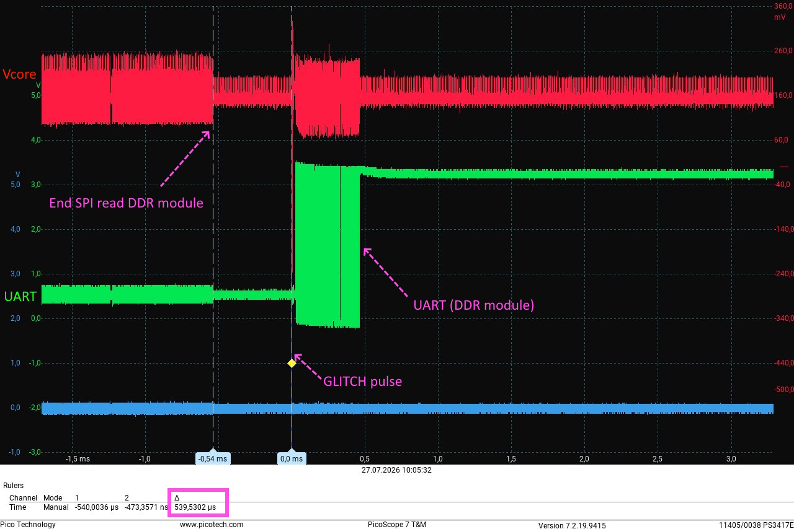

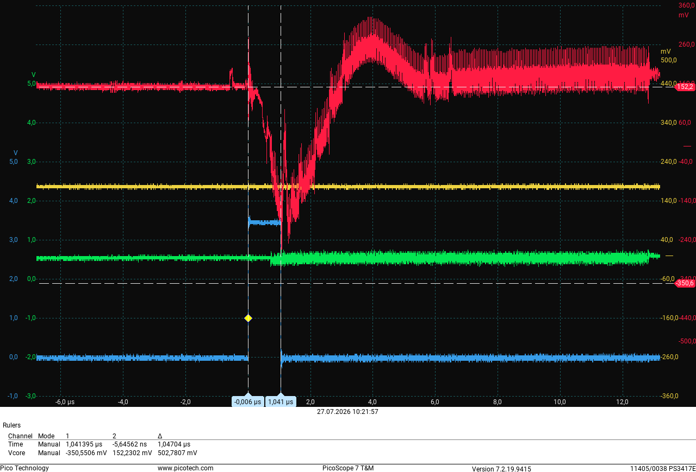

### Links
* [Extract Secure BootROM](https://ptresearch.media/articles/kak-zashifrovat-apelsinku-ili-e-boot-na-orange-pi-5)
