## RTL8762CKF

### Overview
The **RTL8762CKF** is an ultra-low-power system on-chip solution for Bluetooth 5 low energy applications that combines the excellent performance of a leading RF transceiver with a low-power ARM Cortex-M4F and rich powerful supporting features and peripherals.

**RTL8762CKF** provides 6 security levels: 0 to 5. The security levels can be divided into two groups: 0 to 2 and 3 to 5. The only one difference of them is the HCI Download feature. A larger number indicates higher security level, which will affect debug and re-program of eFuse. Function control of each module under different security level is listed in the following table. 

| Security Level | SWD Control        | eFuse Read         | eFuse Write        | HCI Download       | HCI BT Test |
| -------------- | ------------------ | ------------------ | ------------------ | ------------------ | ----------- |
| 0              | Enable             | Enable             | Enable             | Enable             | Enable      |
| 1              | Enable by password | Enable by password | Enable             | Enable             | Enable      |
| 2              | Enable by password | Disable            | Enable by password | Enable             | Enable      |
| 3              | Enable             | Enable             | Enable             | Enable by password | Enable      |
| 4              | Enable by password | Enable by password | Enable             | Enable by password | Enable      |
| 5              | Enable by password | Disable            | Enable by password | Enable by password | Enable      |

The documentation and SDK for this chip can be found here:
[https://www.realmcu.com/en/Resources/SDK/RTL8762C-Series](https://www.realmcu.com/en/Resources/SDK/RTL8762C-Series)  

For testing, you can solder the **RTL8762CKF** chip onto the addon board without any lock enabled and then activate the protection on it. It is recommended to use FT232 USB to UART converter boards for better stability. Connect addon board to USB to UART adapter as depicted below and use **MP Tool**  utility.  

Note: 2.5V (±10%) power supply must be applied when programming eFuse. The flash procedure supports wide voltage range and can be powered by 2.5V (±10%) as well. Under such circumstances, Flash and eFuse can be programmed in one step.  

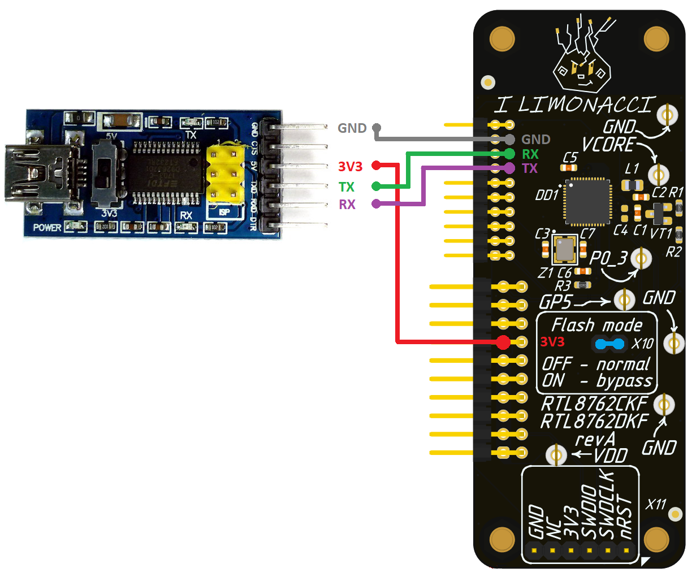
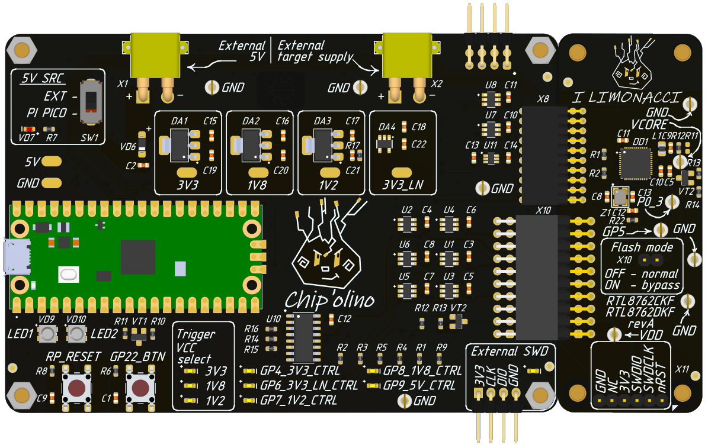
## Glitch can bypass SWD password check on boot.
During the security research of RTL8762CKF we were able to dump ROM from chip. One of the ROMs functions: **configure_security_register_and_LOCK_it()**  performs check of security state of IC and also verifies password to unlock SWD (Security LOCK_MODE 5, greatest).

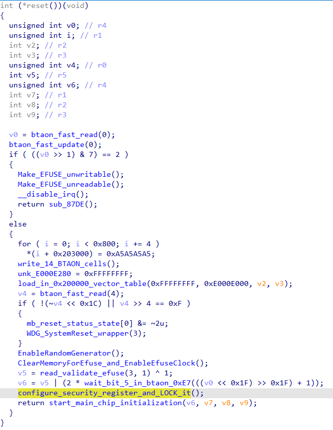

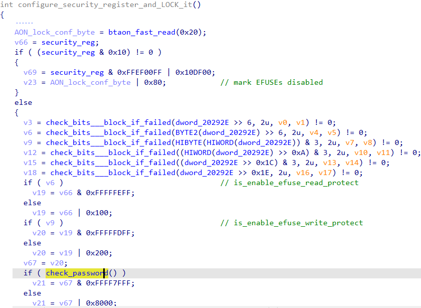  

In **check_password()** function we identified, after memcmp() function we can possibly glitch CPU power to skip instruction or revert state of R0 register.

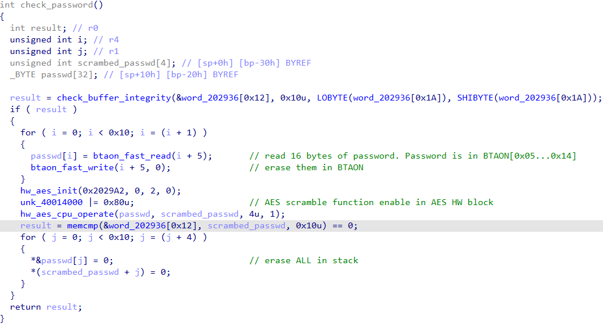

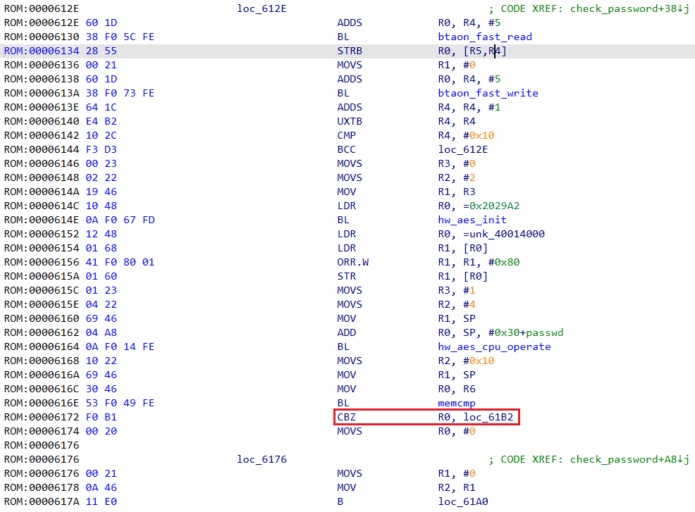

Note, there are several places in the code where successfull glitch (that skips instruction or alters register value) may lead to SWD unlock.  

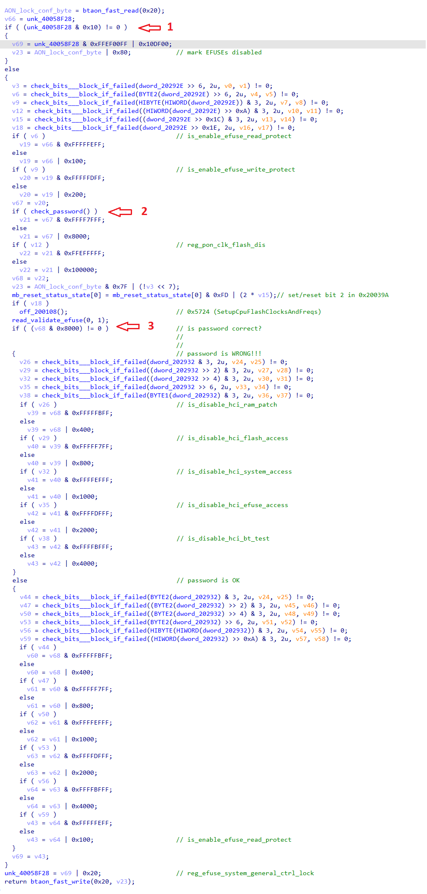

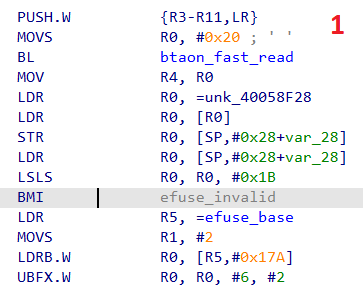

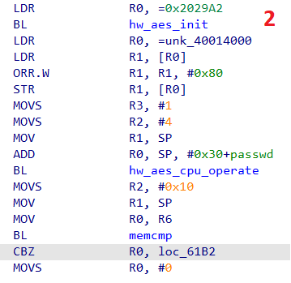

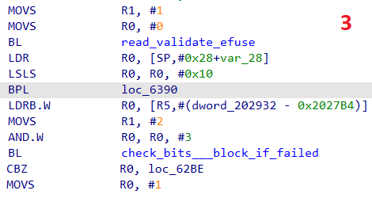

With the EM probe we perform a simple side-channel analysis (SCA) to understand when SWD access check operation is implemented, what parts of bootrom code precede and what follow it. This insight helps us in narrowing down the point in time for the fault injection attack to unlock debug interface with precision of few microseconds.  

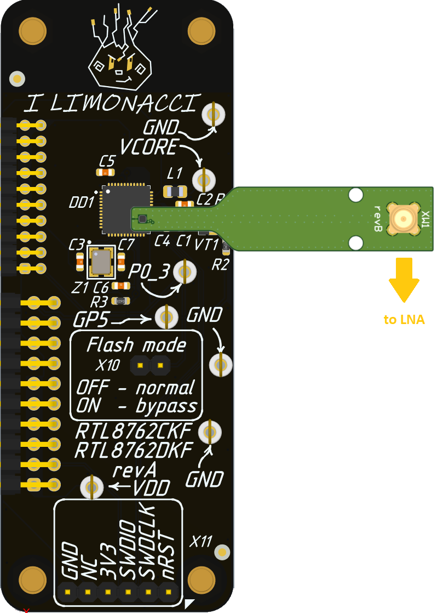  

It is important to note that in order to obtain a clear picture of the chip's EM emission, the value of the capacitance shunting the VDIGI pin of the RTL8762CKF must be reduced to 10 nF.  

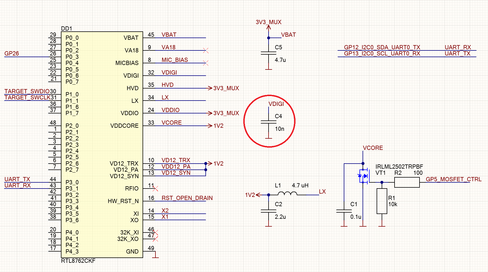  

The following picture shows the EM trace of the chip's activity from the beginning of the bootrom execution.  

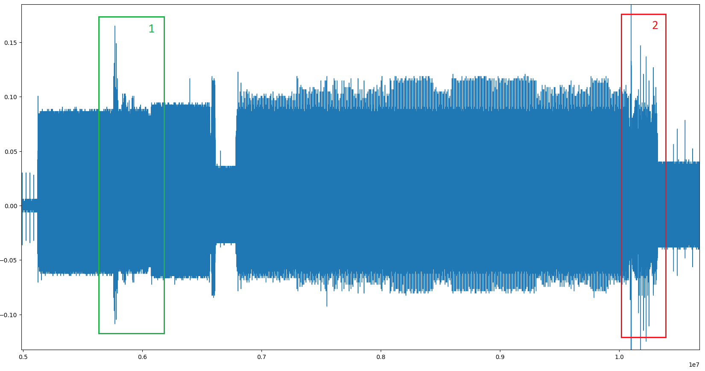  

At the beginning it's easy to visualize the place where 14 bytes of BTAON cells are written (write_14_BTAON_cells()). Moreover all previous and consequent cyclic operations with SRAM are clearly distinguished.  

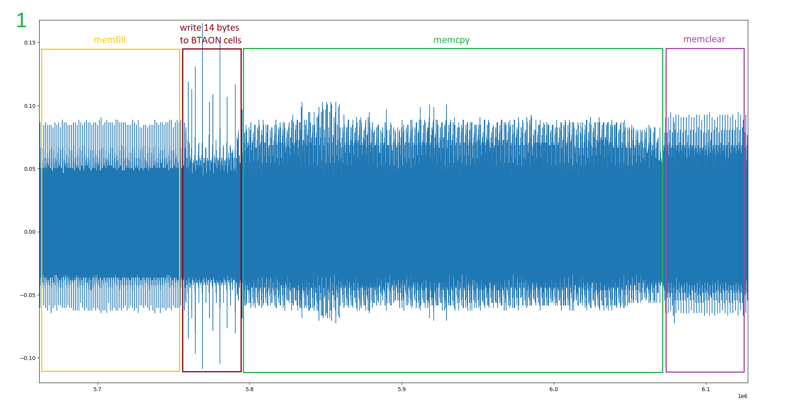  

In the area marked **2** another similar BTAON access pattern is visualized. It correspons to read and clear of 16 cells which store password, and is followed by AES-based password verification. This is the target area for power glitch.  

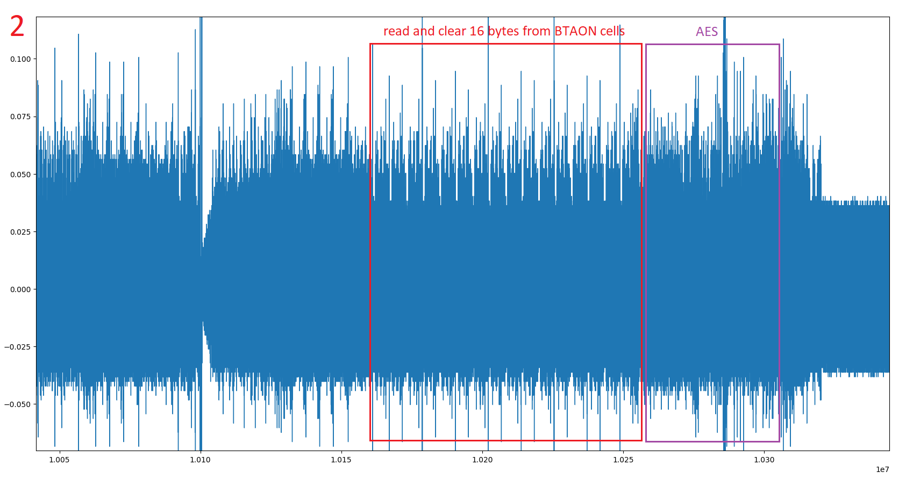  

The following pictures show the chip's EM emission from the start and approximate position for the succesfull power glitch.  

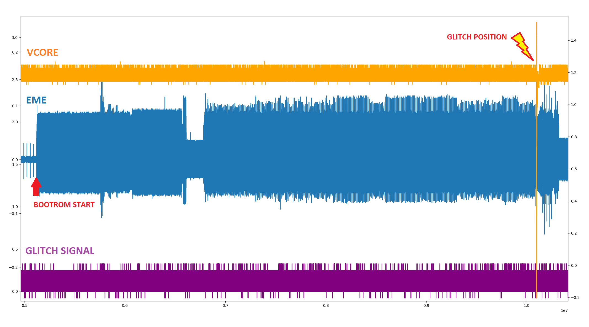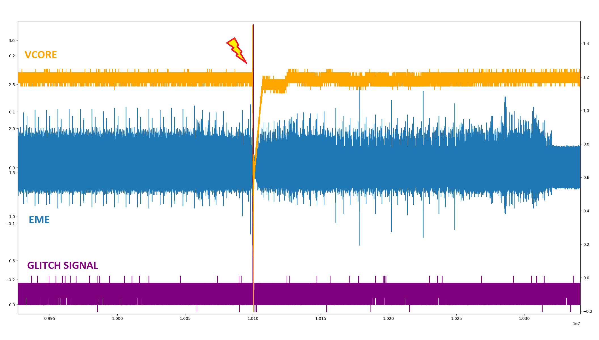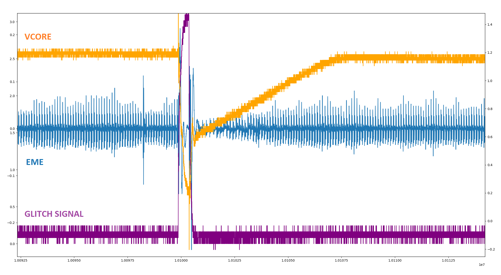  

To carry out power-glitch attack with Chip'olino the automated Python script is used:

```
py.exe chipctrl.py -p COM5 -g -t rtl8762c -o 8516600 9000000 -w 55 65
```

Note, the offset interval (8516600,9000000) and glitch width (55,65) may require some adjustments.  

After a successful attack, the SWD AP becomes accessible. Without disconnecting the addon from Chip'olino, switch the SWD pins from the RTL8762CKF to the external connector and connect а hardware debugger to it.

```bash
# Switch the SWD pins from the MCU to the external connector
py.exe chipctrl.py -p COM5 -swd ext
```

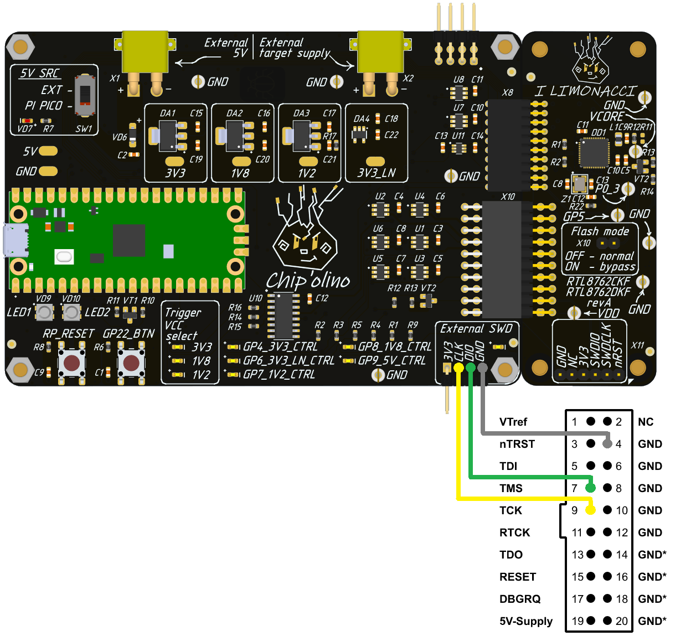