# Renesas
## RH850

<details>
  <summary>Addon RH850</summary>
  
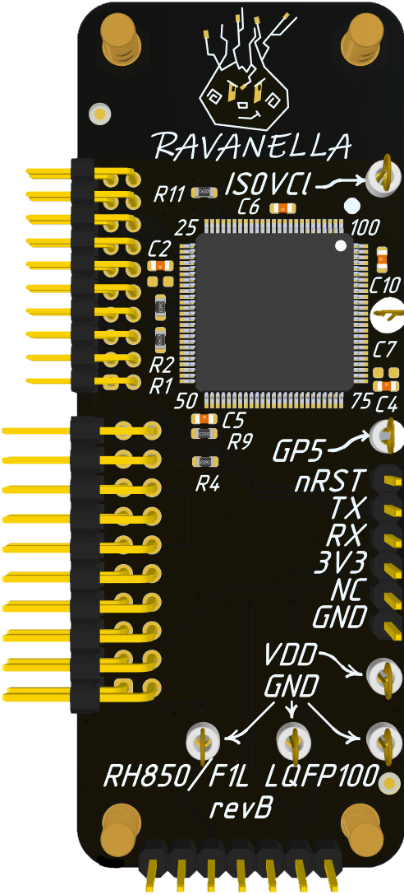

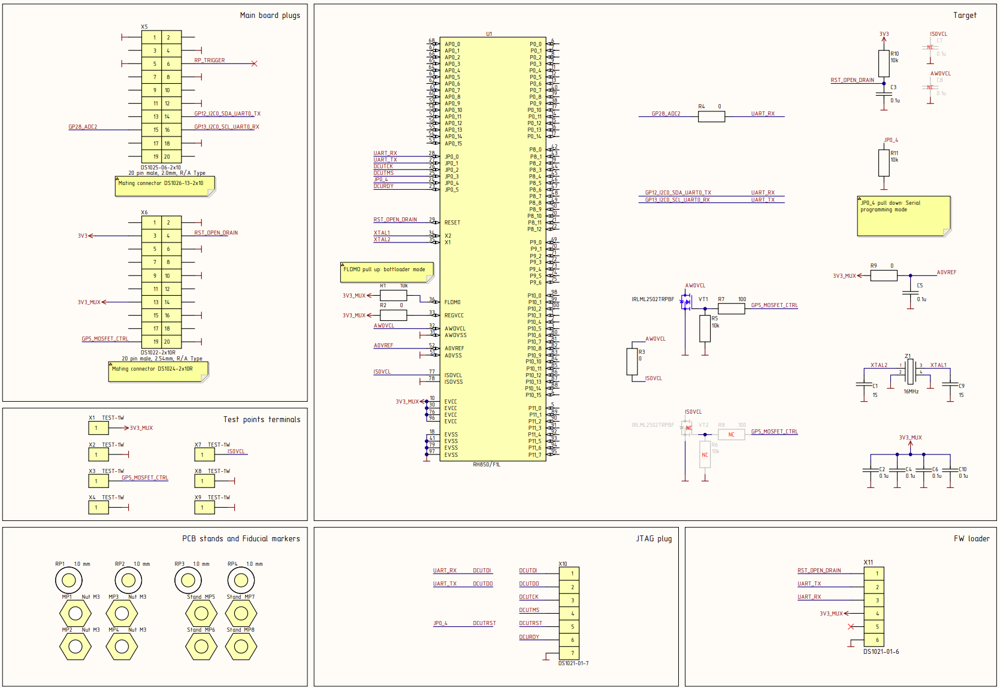

</details>

### Unlock "Serial connection is prohibited"

RH850 имеет несколько функций безопасности. Они могут быть включены, как по одной, так и все вместе. В данной главе речь идет об обходе защиты "Prohibition of connection of a dedicated flash memory programmer" - заблокирована возможность общения с МК в режиме bootloader, как следствие невозможно вычитывать прошивку при помощи штатных команд загрузчика.

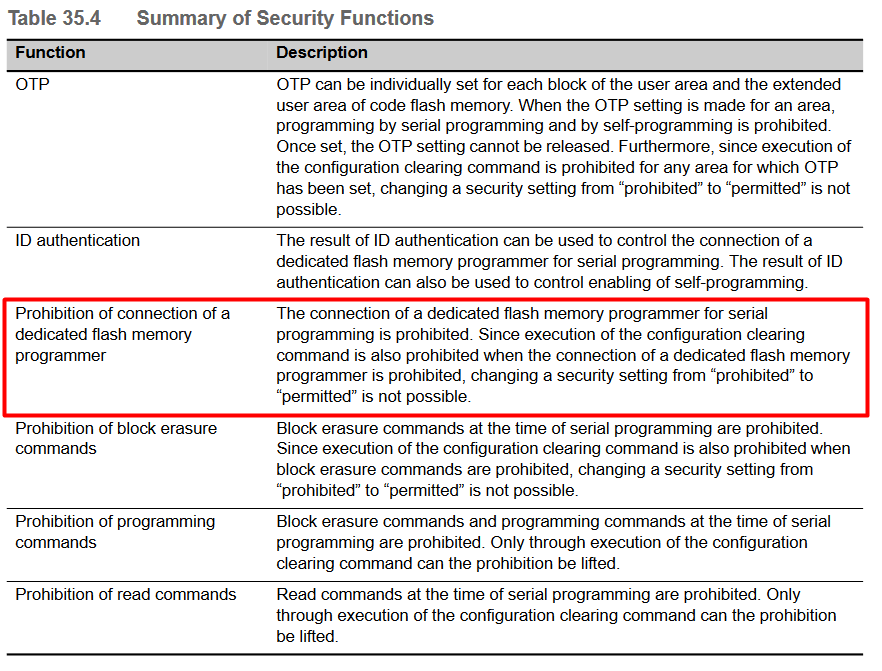

###### Attention!
Перед тем, как провести атаку  стоит убедиться, что установлен именно этот вариант защиты. Сделать это можно при помощи: ***/scripts/check_protect_rh850.py*** или Renesas Flash Programmer.

Подключите аддон (без платы Chip'olino) к ПК через USB-UART адаптер. Линии DTR, RX, TX, 3V3 и GND - обязательны. Далее либо запустите скрипт ***/scripts/check_protect_rh850.py***, либо попробуйте подключиться с помощью Renesas Flash Programmer. В обоих случаях вы должны увидеть сообщение "A serial connection is prohibited for this device".

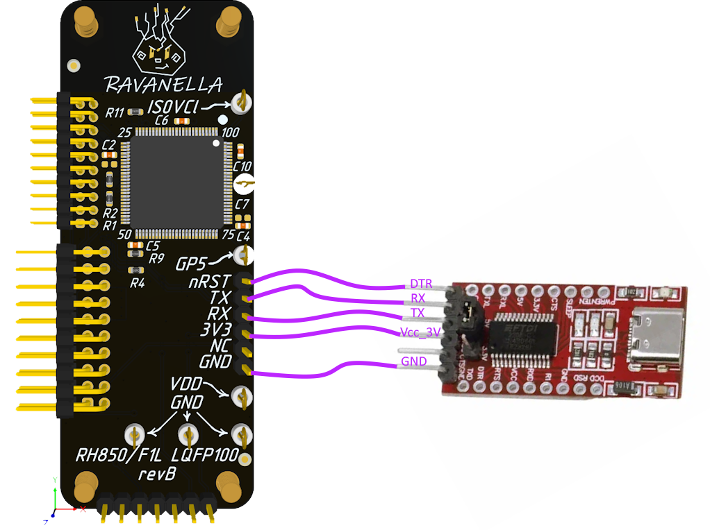

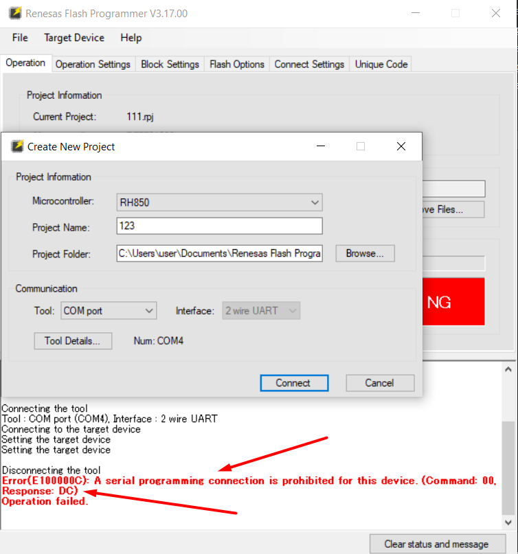

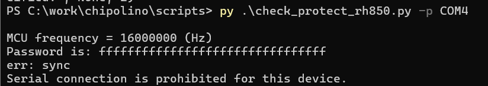

#### Glitch MCU

Для glitch-атаки на аддоне установлен N-MOSFET на выводах AWOVCL и ISOVCL. Также на аддоне установлены необходимые подтягивающие резисторы для запуска МК в режиме bootloader и serial programming mode.
###### Note
Кварцевый резонатор (16МГц) необходим для работы МК.

Момент атаки: после отправки команды "Inquiry" и до приема ответа на нее по UART. В случае, если установлено ограничение на общение по Serial в ответе будет код 0xDC - serial programming disable, то есть ответ будет выглядеть так:
* b'\x81\x00\x01\x00\xFF\x03' - защита не установлена;
* b'\x81\x00\x02\x80\xDC\xA2\x03' - защита установлена.

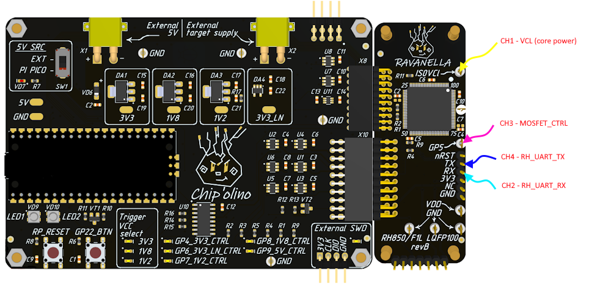
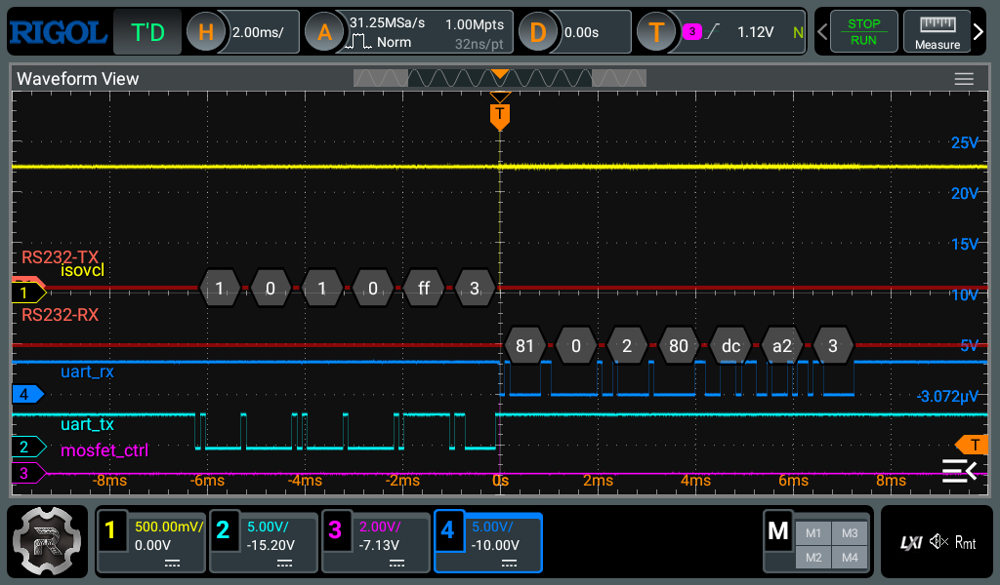

В Chip'olino реализован протокол синхронизации с RH850 по UART. Для успешной атаки необходимо синхронизироваться и отправить несколько предварительных команд до команды "Inquiry".

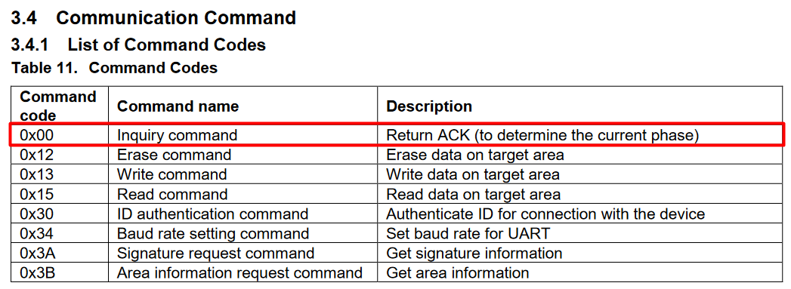

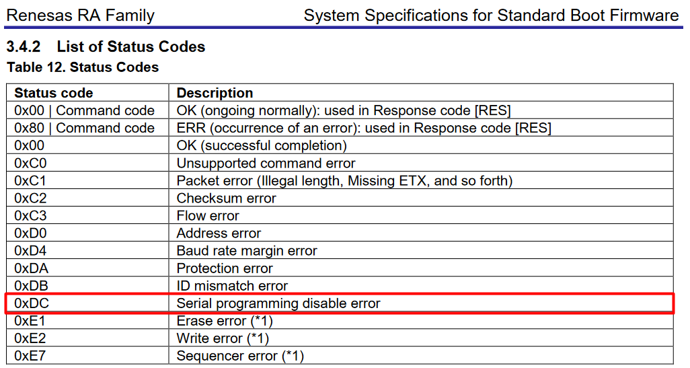

На данном этапе убедились, что установлена защита "Prohibition of connection of a dedicated flash memory programmer" и примерно понимаем, что происходит во время атаки.

Запустите скрипт ***/scripts/chipctrl.py*** с указанными параметрами. 
```bash
py.exe chipctrl.py -p COM5 -g -t rh850 -o 16420 17000 -w 95 105
```
* -p - порт Chip'olino;
* -g - glitch команда;
* -t - наименование целевого МК;
* -o - offset - смещение по времени (в попугаях) от последнего отправленного фронта команды "Inquiry" по UART;
* -w - width - ширина импульса (в попугаях) управляющего N-MOSFET;

###### Note
У вас может отличаться порт, смещение и ширина.

Если вы используете Chip'olino вместе с аддоном, то можно просто запустить скрипт, как показано выше. Параметры смещения и ширины импульса сильно не изменятся. Если что-то не получилось, то ниже приведены скриншоты с осциллографа для успешной атаки. Можно сравнить и форму сигналов и временные параметры, после чего провести дополнительную подстройку смещения и длительности.


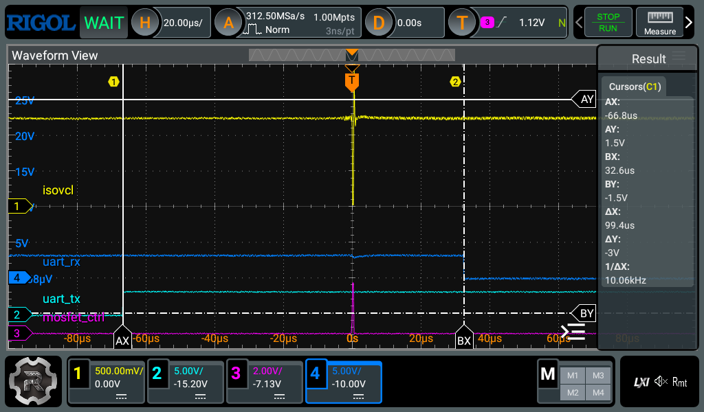

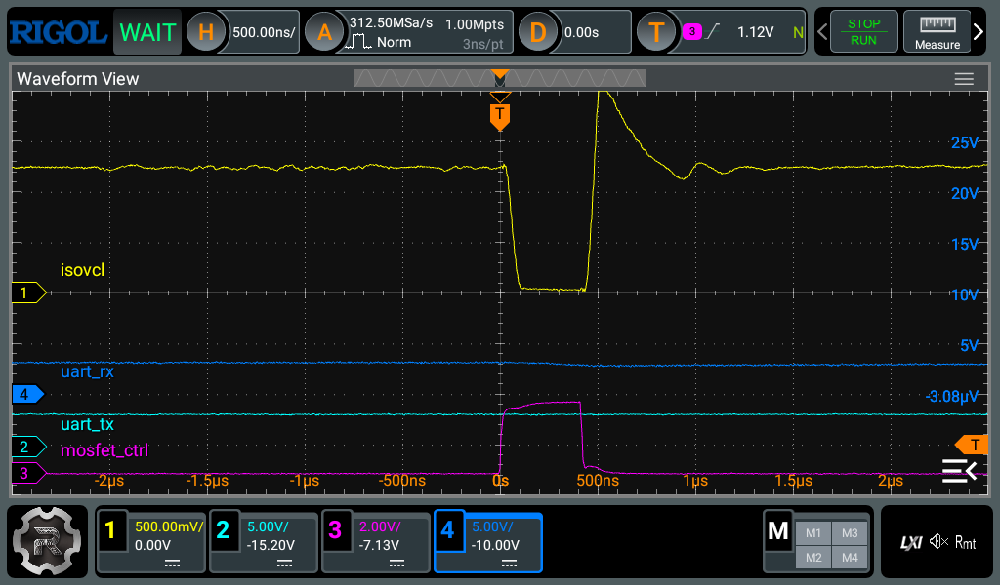

###### Note
Внимательно ознакомьтесь со скриншотами. В случае проблем они могут сильно выручить.
###### Glitch parameters
* ~66 мкс от последнего фронта команды "Inquiry" {0x01, 0x00, 0x01, 0x00, 0xFF, 0x03}, отправленной по UART;
* ~400 нс длительность импульса;
* Способ: N-MOSFET на линиях VCL питания ядра МК.

Запустите скрипт. В случае, если все правильно и Chip'olino работает корректно, вы увидите надпись "Target synchronized" и байт 0xDC в строке **Log**. Обе эти вещи говорят о том, что процесс идет корректно.

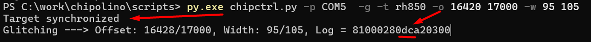

###### Debug note
"Target not synchronized" означает, что нет связи с МК. Проблема скорее всего в сборке аддона. Если в **Log** отсутствует периодический вывод строки с байтом 0xDC, значит, что процесс синхронизации Chip'olino и RH850 не доходит до стадии приема ответа на команду "Inquiry".

#### Dump firmware
После удачного глитча не отключайте аддон от платы Chip'olino, МК остается запитан и может обрабатывать команды по UART. Подключите USB-UART к аддону и к ПК до атаки. Используйте только выводы RX, TX и GND.
###### Attention!
Важно! Не подключать линию DTR-Reset и 3.3V после глитча. При открытии порта происходит сброс.

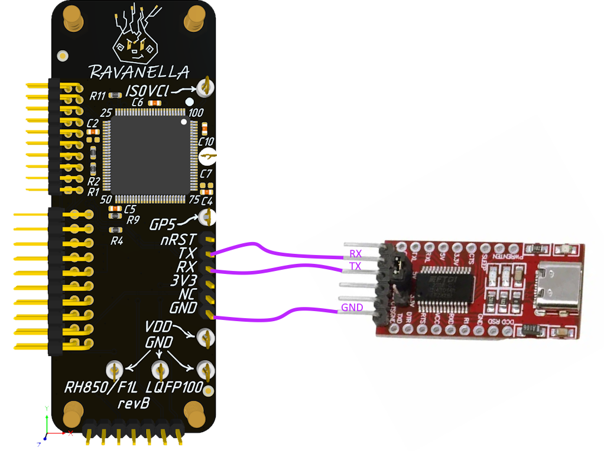

В загрузчике RH850 есть команда с ID=0x15 для чтения памяти, которой теперь можно воспользоваться. Для этого есть готовый скрипт ***/scripts/dump_rh850.py***. 
###### Attention!
Предварительно необходимо ознакомиться с memory map именно вашего МК. В серии RH850 их довольно много, найти нужное описание можно по маркировке на корпусе. 
На МК, который был у меня это номер 10233. По данному номеру в документации находим адреса и размеры нужных регионов памяти.


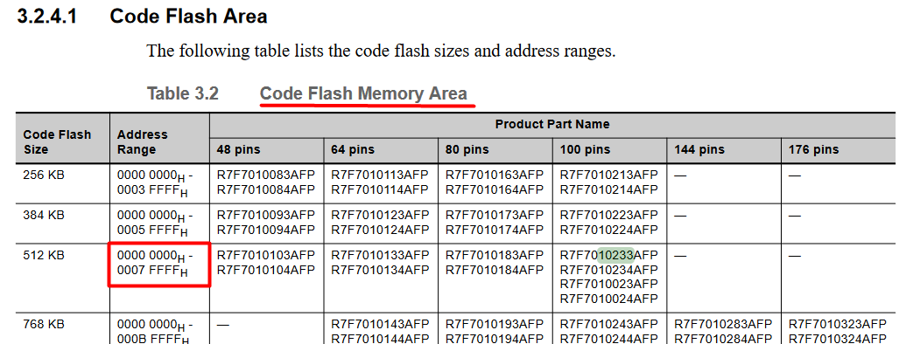


Используйте скрипт для дампа памяти RH850 ***/scripts/dump_rh850.py***
```bash
# dump code flash
py .\dump_rh850.py -p COM4 -a 0x0 0x07ffff -f rh850_code_flash.bin

# dump data flash
py .\dump_rh850.py -p COM4 -a 0x0 0xFF207ffff -f rh850_data_flash.bin
```
###### Note
Обратите внимание, что COM-порт нужно указывать не Chip'olino, а USB-UART адаптера.

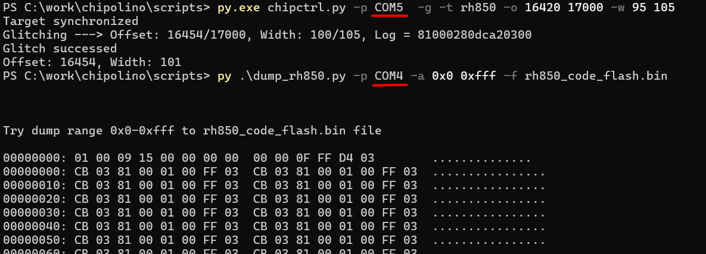

### Links
* https://icanhack.nl/blog/rh850-glitch/
* https://github.com/I-CAN-hack/rh850-glitch
* Renesas Flash Programmer V3.17