# Renesas
## RH850

MCUs built on the RH850 architecture include a wide range of microcontroller families. All of them feature several security mechanisms, but only three can actually interfere with firmware extraction. Chip'olino supports bypassing all of these protections: [Unlock "ID authentication"](#id_lock), [Unlock "Read protection"](#rp_lock), [Unlock "Serial connection is prohibited"](#ser_lock).


### Supported devices

The most detailed description is provided for bypassing the protection [Unlock "Serial connection is prohibited"](#ser_lock), so it's best to start reading from there. All attacks use the same add-on — there's no need to rewire or modify it depending on the type of protection.
Currently, the repository includes add-ons for:
* RH850 F1L family
* RH850 F1KM family (in progress, will be soon)
* ...
* any RH850 MCU - using the universal add-on.

<details>
  <summary>Addon RH850 (F1L)</summary>
  


</details>


### <span id="id_lock">Unlock "ID authentication"</span>

The most commonly used protection level for RH850 MCUs is **ID authentication.** This means a password has been set. Without it, you cannot read memory, erase the microcontroller, write to memory, or perform other operations. Essentially, all bootrom commands remain inaccessible until the correct password — the _IDCODE_ — is entered.

| Function          | Description                                                                                                                                                                                                                          |
| ----------------- | ------------------------------------------------------------------------------------------------------------------------------------------------------------------------------------------------------------------------------------ |
| ID authentication | The result of ID authentication can be used to control the connection of a<br>dedicated flash memory programmer for serial programming. The result of ID<br>authentication can also be used to control enabling of self-programming. |

To determine the protection level, you can use either the Renesas Flash Programmer utility or a script **/scripts/check_protect_rh850.py**. To do this, connect the addon to the PC using a USB-UART adapter.

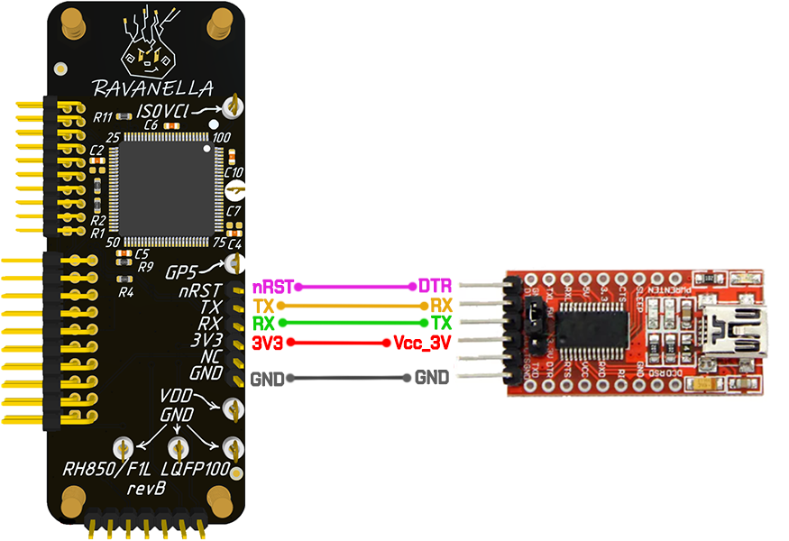

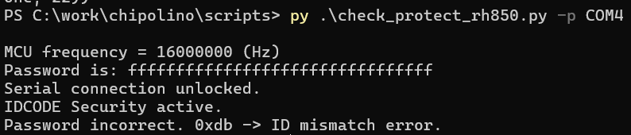

#### Glitch MCU

To communicate with a password-protected MCU, you need to send several commands in a specific order. After that, the MCU will enter a normal command processing mode, which includes the ability to read FLASH memory. Below is the list of required commands:

| Command | Description     |
| ------- | --------------- |
| 0x38    | get device type |
| 0x32    | set frequency   |
| 0x34    | set baudrate    |
| 0x00    | inquiry         |
| 0x2C    | is_set_IDCODE   |
| 0x30    | IDCODE check    |

The argument of command 0x30 is a 16-byte IDCODE. If the password is incorrect, the MCU will respond with an error **0xDB - ID mismatch**.

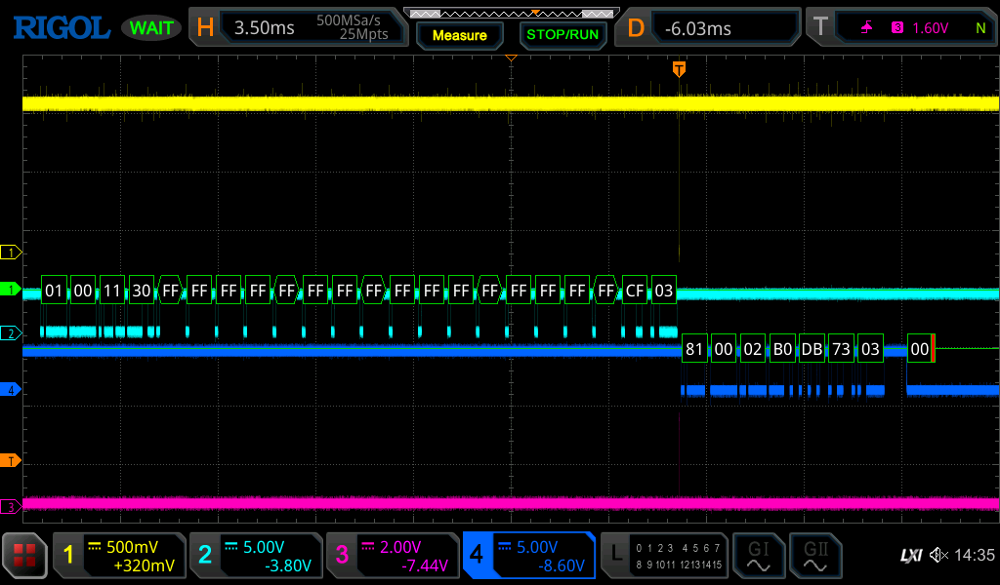

To bypass glitch protection, the glitch must be triggered during the time window between sending the password and receiving the MCU's response.  Any password can be used as the argument for command `0x30`; by default, Chip'olino uses 16 bytes of `0xFF`.
To launch the attack, run the script **/scripts/chipctrl.py** for target (-t) "rh850_id":

```bash
py.exe chipctrl.py -p COM5 -g -t rh850_id -o 17660 37000 -w 95 117
```

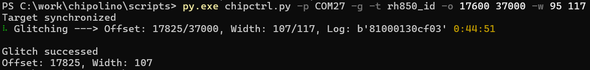

An example of a successful attack for the IDCODE bypass is shown below.

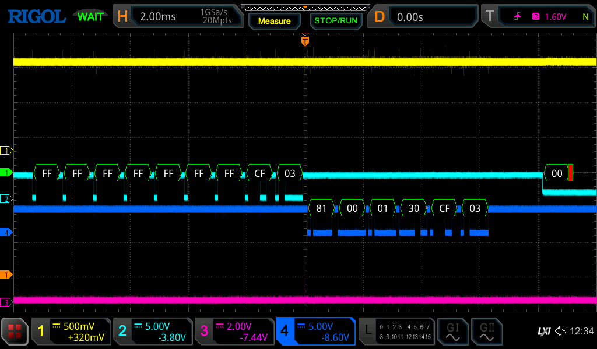

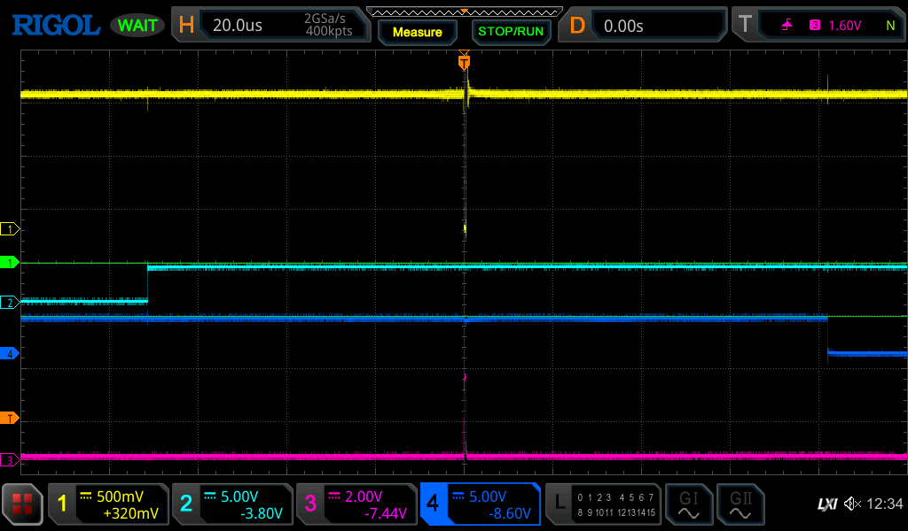

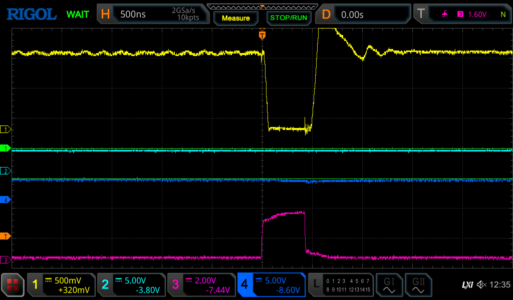

###### Glitch parameters
* ~66 µs from the last edge of the "idcode_check" (0x30) command sent over UART;
* ~400 ns pulse duration;
* Method: N-MOSFET on the VCL lines powering the MCU core.

#### Dump firmware
After a successful glitch, do not disconnect the add-on from the Chip'olino board — the MCU remains powered and can process commands over UART. Connect the USB-UART adapter to the add-on and to the PC **before** the attack. Use only the RX, TX, and GND pins.
##### Attention!
```
Important! Do not connect the DTR-Reset line or 3.3V after the glitch. Opening the port triggers a reset.
```

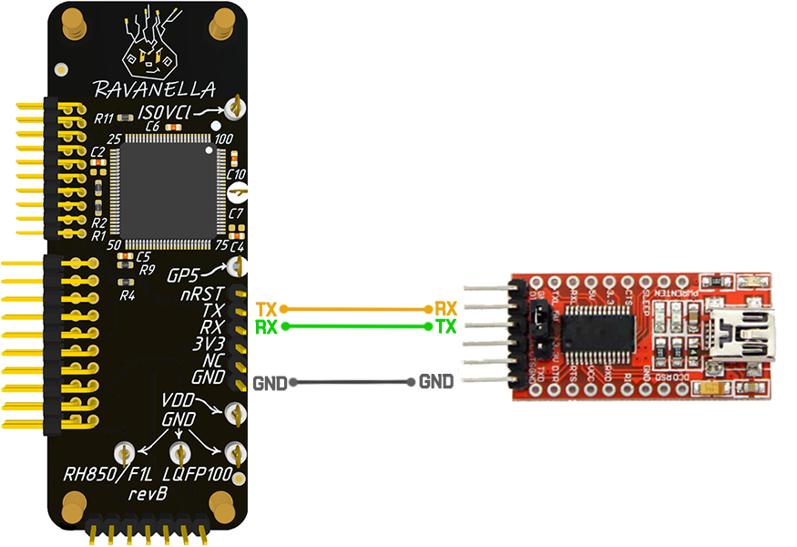

The RH850 bootloader includes a memory read command with ID = 0x15, which can now be used.  
There is a ready-to-use script for this: _**/scripts/dump_rh850.py**_.
##### Attention!
```
Beforehand, you need to review the memory map specific to your MCU. There are quite a few variants in the RH850 series.
```

Use the script for dumping RH850 (10233) memory: ***/scripts/dump_rh850.py***
```bash
# dump code flash
py .\dump_rh850.py -p COM4 -a 0x0 0x07ffff -f rh850_code_flash.bin

# dump data flash
py .\dump_rh850.py -p COM4 -a 0xFF200000 0xFF207fff -f rh850_data_flash.bin
```

### <span id="rp_lock">Unlock "Read protection"</span>

Another protection level that prevents extracting firmware from RH850 MCUs is **Prohibition of read commands**. This means the memory read command is disabled. Without this protection, you can put the MCU into bootrom mode. After the synchronization process, the MCU is ready to process various commands, including command `0x15` — "Read memory". This allows reading the MCU’s FLASH memory.
However, if the "Read protection" is enabled, reading memory this way won’t work because the MCU will respond to the "Read memory" command with an error.

| Function                     | Description                                                                                                                                                    |
| ---------------------------- | -------------------------------------------------------------------------------------------------------------------------------------------------------------- |
| Prohibition of read commands | Read commands at the time of serial programming are prohibited. Only<br>through execution of the configuration clearing command can the prohibition be lifted. |

To determine the protection level, you can use either the Renesas Flash Programmer utility or a script **/scripts/check_protect_rh850.py**. To do this, connect the addon to the PC using a USB-UART adapter.


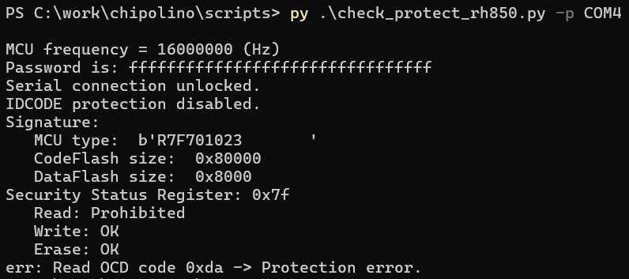

#### Glitch MCU

To communicate with a password-protected MCU, you need to send several commands in a specific order. After that, the MCU will enter a normal command processing mode, including the ability to read FLASH memory. Below is the list of required commands:

| Command | Description     |
| ------- | --------------- |
| 0x38    | get device type |
| 0x32    | set frequency   |
| 0x34    | set baudrate    |
| 0x00    | inquiry         |
| 0x21    | read_ssr        |
| 0x15    | read memory     |

The argument for command `0x15` consists of the start and end addresses of the memory range to read. Each address is 32 bits. If protection is enabled, the MCU will respond with the error **0xDA - protection error**.

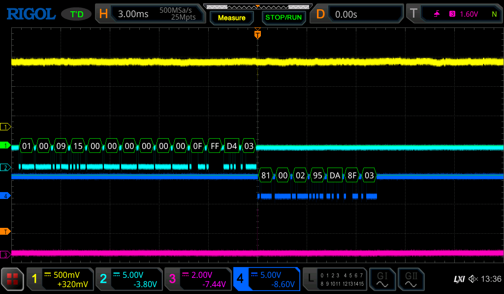

To bypass the protection, a glitch must be triggered during the time window between sending the memory read command and receiving the MCU's response. If the attack is successful, you can continue the reading process via USB-UART. The memory read command occurs in two iterations:
* Sending the command and waiting for the MCU's response;
* Receiving data from the MCU in 0x400-byte chunks.

To launch the attack, run the script **/scripts/chipctrl.py** for target (-t) "rh850_rp":

```bash
py.exe chipctrl.py -p COM5 -g -t rh850_rp -o 17660 37000 -w 95 117
```

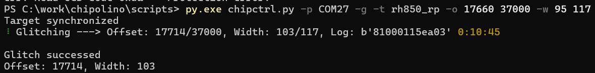

An example of a successful attack for the read protection bypass is shown below.

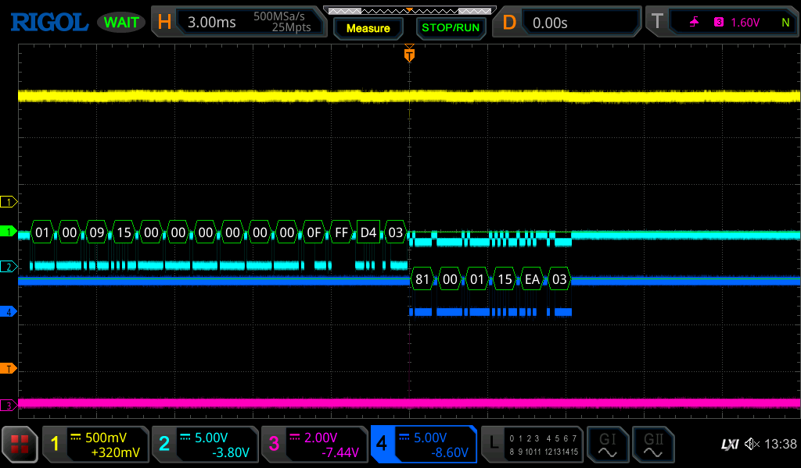

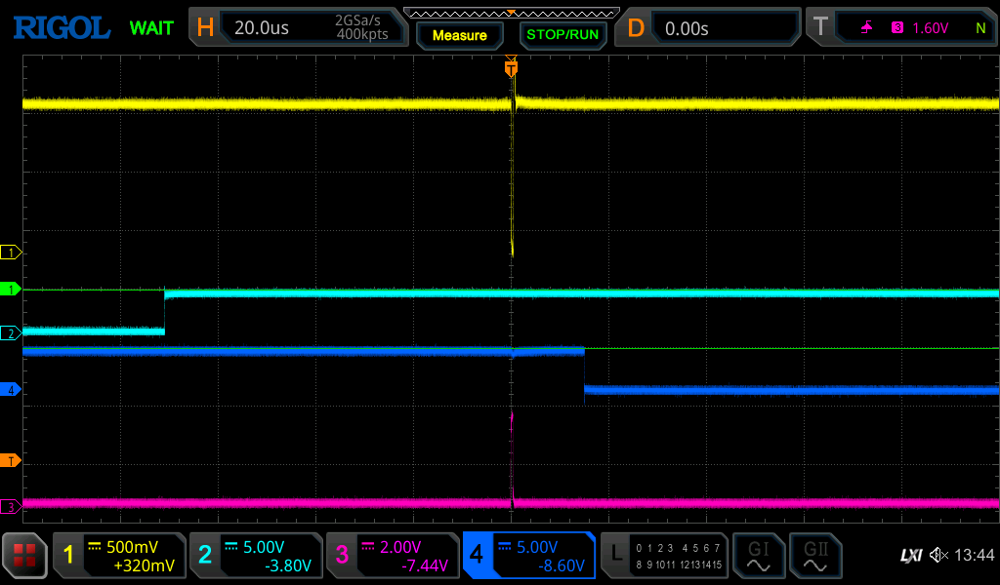

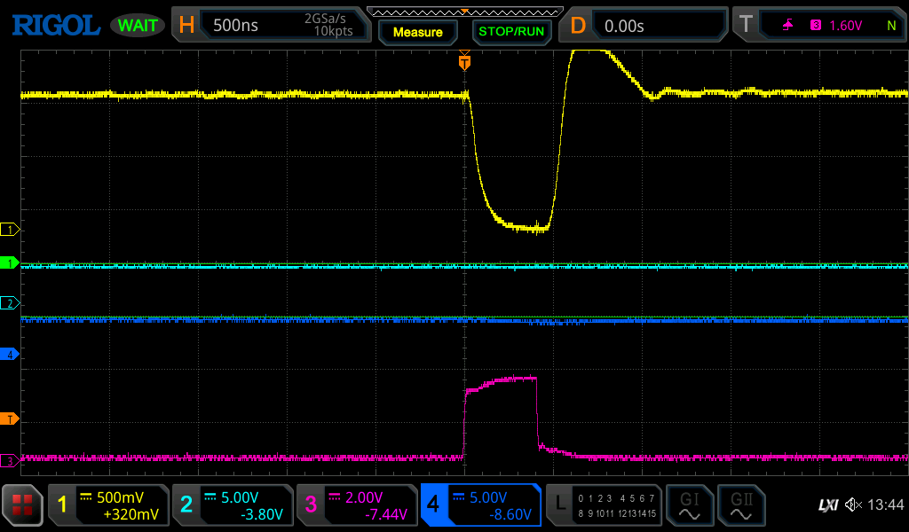

###### Glitch parameters
* ~70 µs from the last edge of the "read memory" (0x15) command sent over UART;
* ~400 ns pulse duration;
* Method: N-MOSFET on the VCL lines powering the MCU core.

### <span id="ser_lock">Unlock "Serial connection is prohibited"</span>

RH850 has several security features. They can be enabled individually or all at once. This chapter focuses on bypassing the protection called "**Prohibition of connection of a dedicated flash memory programmer"** — which blocks communication with the MCU in bootloader mode, making it impossible to read the firmware using standard bootloader commands.

| Function                                                         | Description                                                                                                                                                                                                                                                                                                                     |
| ---------------------------------------------------------------- | ------------------------------------------------------------------------------------------------------------------------------------------------------------------------------------------------------------------------------------------------------------------------------------------------------------------------------- |
| Prohibition of connection of a dedicated flash memory programmer | The connection of a dedicated flash memory programmer for serial programming is prohibited. Since execution of the configuration clearing command is also prohibited when the connection of a dedicated flash memory programmer is prohibited, changing a security setting from “prohibited” to<br>“permitted” is not possible. |

##### Attention!
```
Before carrying out the attack, make sure that this specific protection is enabled. You can verify this by using either /scripts/check_protect_rh850.py or the Renesas Flash Programmer.
```

Connect the addon (without the Chip'olino board) to the PC via a USB-UART adapter. The DTR, RX, TX, 3.3V, and GND lines are mandatory. Then either run the script _**/scripts/check_protect_rh850.py**_ or try to connect using the Renesas Flash Programmer. In both cases, you should see the message:  
**"A serial connection is prohibited for this device."**


#### Glitch MCU

For the glitch attack, an N-MOSFET is installed on the AWOVCL and ISOVCL pins of the addon. Additionally, the addon has the required pull-up resistors installed to enable the MCU to start in bootloader and serial programming mode.

##### Note
```
A quartz crystal resonator (16 MHz) is required for the microcontroller to operate.
```

The glitch moment is after sending the "Inquiry" command and before receiving its response over UART. If serial communication is restricted, the response will include the code 0xDC indicating "serial programming disabled." Specifically, the responses look like this:
* b'\x81\x00\x01\x00\xFF\x03' — protection is **not** enabled;
* b'\x81\x00\x02\x80\xDC\xA2\x03' — protection **is** enabled.


Chip'olino implements a synchronization protocol with the RH850 via UART. For a successful attack, it is necessary to synchronize and send several preliminary commands before the "Inquiry" command.


At this stage, we have confirmed that the "Prohibition of connection of a dedicated flash memory programmer" protection is enabled and have a rough understanding of what happens during the attack.

Run the script **/scripts/chipctrl.py** with the specified parameters.
```bash
py.exe chipctrl.py -p COM5 -g -t rh850_ser -o 16420 17000 -w 95 105
```

###### Note
```
Your port, offset, and pulse width may differ.
```

If you are using Chip’olino together with the addon, you can simply run the script as shown above. The glitch offset and pulse width parameters usually won’t change much. If something doesn’t work out, below are oscilloscope screenshots of a successful attack. You can compare both the signal shape and timing parameters, then fine-tune the offset and pulse duration accordingly.

###### Note
```
Carefully review the screenshots — they can be extremely helpful in case any issues arise.
```


###### Glitch parameters
* ~66 µs from the last edge of the "Inquiry" command `{0x01, 0x00, 0x01, 0x00, 0xFF, 0x03}` sent over UART;
* ~400 ns pulse duration;
* Method: N-MOSFET on the VCL lines powering the MCU core.

Run the script. If everything is set up correctly and Chip'olino is functioning properly, you will see the message **"Target synchronized"** and the byte **0xDC** in the **Log** output. Both of these indicate that the process is working as expected.


##### Debug note
```
"Target not synchronized" means there is no communication with the MCU. The issue is most likely related to the assembly of the add-on.
If the Log does not show a periodic line containing the byte `0xDC`, it means the synchronization process between Chip'olino and the RH850 does not reach the stage of receiving a response to the "Inquiry" command.
```


#### Dump firmware
After a successful glitch, do not disconnect the add-on from the Chip'olino board — the MCU remains powered and can process commands over UART. Connect the USB-UART adapter to the add-on and to the PC **before** the attack. Use only the RX, TX, and GND pins.
##### Attention!
```
Important! Do not connect the DTR-Reset line or 3.3V after the glitch. Opening the port triggers a reset.
```


The RH850 bootloader includes a memory read command with ID = 0x15, which can now be used.  
There is a ready-to-use script for this: _**/scripts/dump_rh850.py**_.
##### Attention!
```
Beforehand, you need to review the memory map specific to your MCU. There are quite a few variants in the RH850 series, and the correct documentation can be found based on the marking on the chip package.
For the MCU I had, the marking was 10233. Using this number, you can locate the addresses and sizes of the required memory regions in the documentation.
```


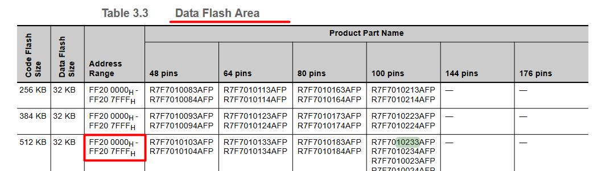

Use the script for dumping RH850 memory: ***/scripts/dump_rh850.py***
```bash
# dump code flash
py .\dump_rh850.py -p COM4 -a 0x0 0x07ffff -f rh850_code_flash.bin

# dump data flash
py .\dump_rh850.py -p COM4 -a 0xFF200000 0xFF207fff -f rh850_data_flash.bin
```
##### Note
```
Note that the COM port to be specified is not for Chip'olino, but for the USB-UART adapter.
```


### Links
* https://icanhack.nl/blog/rh850-glitch/
* https://github.com/I-CAN-hack/rh850-glitch
* Renesas Flash Programmer V3.17