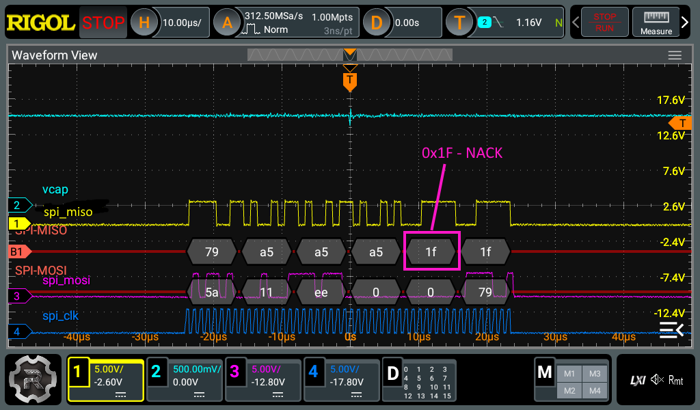
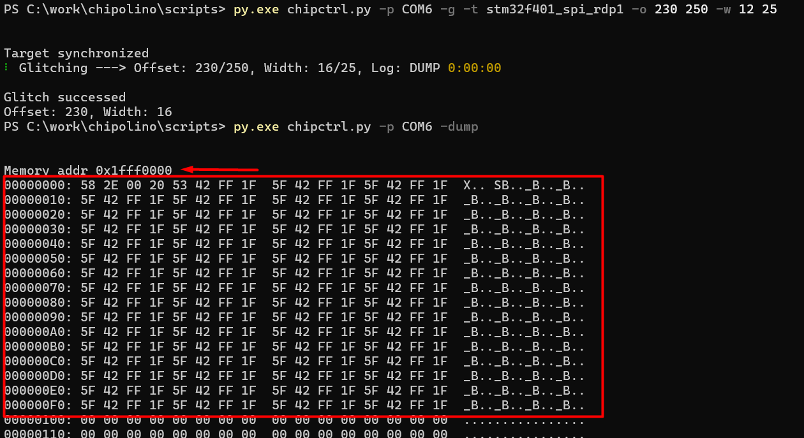
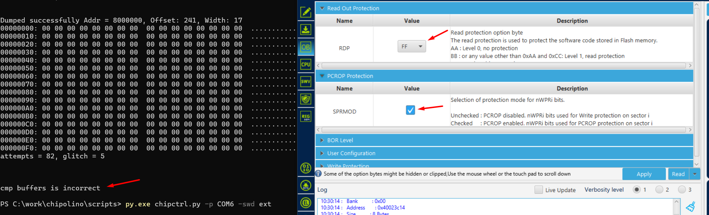

# STM32

У STM32 есть защита - Readout Protection (RDP). Для старших версий чипов справедливо утверждение, что уровней защиты три, где 0-ой - это отсутствие защиты. RDP1 - нет доступа к flash-памяти, RDP2 - отключен отладочный интерфейс. Также обычно указано, что из RDP2 нельзя вернуть чип в исходное состояние, а из RDP1 можно, но с полным стиранием flash-памяти.

###### Note
У всех STM32 защита устроена примерно одинаково, но есть небольшие различия. Читайте документацию на конкретно ваш МК.
* Для STM32F401 ([RM0368 Reference manual](https://www.st.com/resource/en/reference_manual/rm0368-stm32f401xbc-and-stm32f401xde-advanced-armbased-32bit-mcus-stmicroelectronics.pdf))
* Для STM32F411 ([RM0383 Reference manual](https://www.st.com/resource/en/reference_manual/rm0383-stm32f411xce-advanced-armbased-32bit-mcus-stmicroelectronics.pdf))

В общем случае включить МК STM32, запаянный на аддон, можно так:
```bash
# Включить питание STM32 (3.3V)
py.exe chipctrl.py -p COM5 -gp 4 1
# Не подтягивать пин Reset МК к земле
py.exe chipctrl.py -p COM5 -gp 2 0

# Переключить SWD пины от МК на разъем для внешнего подключения
py.exe chipctrl.py -p COM5 -swd ext
```

После этого МК на аддоне будет включен в режиме бутлоадера и к нему можно будет подключиться через внешний разъем SWD на Chip'olino, используя J-Link\ST-Link и STM32CubeProgrammer. 
Это дает возможность выставлять уровни защиты или посмотреть текущий. Также можно посмотреть версию бутлоадера на МК.


### RDP1 
Атака на RDP1 предполагает включение МК в режиме bootloader (system memory). Далее идет попытка прочитать flash-память, используя штатную команду загрузчика - 0x11 (read memory). Команда может быть отправлена по различным интерфейсам - UART, SPI, I2C, CAN, USB.


###### Note
Какие интерфейсы поддерживает МК можно посмотреть в [AN2606 Application note STM32 microcontroller system memory boot mode](https://www.st.com/resource/en/application_note/an2606-stm32-microcontroller-system-memory-boot-mode-stmicroelectronics.pdf). Это зависит не только от серии МК, но и от версии его загрузчика.

Для атаки необходимо сбоить работу ядра МК сразу после отправки команды. Если установлен уровень защиты RDP1, то в ответ на запрос придет NACK (0x1F). Цель: найти место и параметры глича, когда МК ответит на запрос ACK (0x79).




Самый популярный вариант атаки по питанию на STM32 предполагает установку транзистора N-MOSFET на вывод Vcap (core power), если она есть. Если выводов Vcap два, то можно экспериментировать, как лучше воздействовать - на один пин или на оба сразу. Иногда Vcap отсутствует, тогда атака осуществляется по линии основного питания МК 3.3V.


Привязываться по времени для точного проведения атаки лучше всего непосредственно к фронтам на интерфейсных линиях. Например, лучший вариант атаки на STM32F407 предполагает отсчет времени для атаки от последнего фронта на линии UART_TX. То есть, как только команда read memory отправлена - начинаем считать. Для других серий STM32 удобнее использовать привязку к фронтам на линии SPI_CLK. Привязка к SPI дает более точный результат, в сравнении с UART.

## STM32F401, STM32F411

<details>
  <summary>Addon STM32F401/411</summary>
  


</details>

### Bypass RDP1

Атаку на STM32F401/411 лучше всего проводить с привязкой к SPI_CLK линии (если бутлоадер поддерживает SPI) в момент отправки команды чтения памяти. Для этого PIO state machine настроена так, что с начала отправки команды 0x11 ожидается 24 фронта на линии, после чего стартует отсчет до глича. За 24 такта на линии отправляется три байта от master к slave. Команда по SPI для загрузчика состоит из байтов {0x5A, cmd_byte, cksm_cmd_byte}. В случае с командой чтения это: {0x5A, 0x11, 0xEE}.

#### Glitch MCU

Для запуска атаки нужно запаять STM32F401/411 на аддон **\pcb\STM\STM32F411CCU_revA**. Далее запустить скрипт:

```bash
py.exe chipctrl.py -p COM6 -g -t stm32f401_spi_rdp1 -o 220 260 -w 10 23
```


###### Debug note
"Target not synchronized" после запуска атаки значит, что либо аддон собран некорректно, либо выставлен уровень зашиты RDP2. 

###### Debug note
Периодически мелькающая надпись "NACK" в поле **Log** во время перебора свидетельствует о том, что процесс идет нормально.


Взглянуть, как идет процесс и отладить его можно при помощи осциллографа. Ниже показаны осциллограммы удачной атаки. На них можно подсмотреть временные характеристики атаки.


###### Note
Внимательно ознакомьтесь со скриншотами. В случае проблем они могут сильно выручить.
###### Glitch parameters
* ~1 мкс от 24-ого фронта посылки команды "read memory";
* ~100 нс длительность импульса;
* Способ: N-MOSFET на линиях Vcap питания ядра МК.

#### Dump firmware

Процесс получения ПО из заблокированного STM32 довольно длительный процесс. Команда бутлоадера, работа которой нарушается при атаке, дает возможность прочитать только 0x100 байт. Одной атакой не обойтись и придется атаковать вычитку каждого следующего кусочка памяти. По умолчанию, скрипт **/scripts/chipctrl.py** с аргументом **-g** отправляет команду GLITCH в Chip'olino. Для всех STM32 в прошивке указан адрес секции system memory (bootloader). То есть, все тестовые запуски - это всегда попытка считать первые 0х100 байт загрузчика.
###### Attention!
Во время глича STM32 есть очень высокий шанс нарушить работу flash контроллера МК (FMC). Это приводит к потере данных во flash-памяти.

Для того, чтобы этого избежать нужно на тестовом МК подобрать оптимальные параметры атаки и сузить окно перебора до минимума. Все, что указано в главе **Glitch MCU** позволяет первично обнаружить место и параметры атаки.

После успешного глича можно вызвать скрипт **chipctrl.py** c аргументом **-dump** для того, чтобы посмотреть содержимое буфера с данными, которые удалось прочитать в результате атаки.

```bash
# Просмотр буфера с данными после атаки STM32 RDP1
py.exe chipctrl.py -p COM6 -dump
```


Команда **dump** выведет и содержимое буфера, и адрес памяти откуда происходило чтение. В данном случае для STM32F401 читалась память по адресу 0x1FFF0000 (system memory). 

Для зацикливания атаки и последовательного чтения памяти нужно использовать скрипт **/scripts/dump_stm32.py**.
###### Note
Обратите внимание, на сколько точно можно подобрать параметры для атаки с привязкой к SPI.

```bash
py.exe .\dump_stm32.py -p COM6 -t stm32f401_spi_rdp1 -o 239 240 -w 16 17 -a 0x8000000 0x8000600 -f flash_401.bin
```

При таком запуске Chip'olino будет в цикле гличить, перебирая и смещение, и ширину импульса по кругу, пока не удастся считать кусок памяти по начальному адресу. Потом значение адреса увеличится на 0x100 и процесс будет повторен. В таком случае надо задать начальный и конечный адрес памяти через аргумент **-a** и файл, куда будут сохраняться вычитанные данные через аргумент **-f**.


###### Attention!
Избежать сбоя FMC можно точно подобрав параметры атаки. Для этого предварительно нужно провести испытания на тестовом МК. Запаяйте на аддон тестовый МК, запишите ему во flash память любой паттерн из 0x100 байт. Подберите параметры атаки такие, что МК не будет стираться. 

Для такого тестирования есть скрипт **/scripts/test_erase_stm32.py**.

```bash
py.exe .\test_erase_stm32.py -p COM6 -t stm32f401_spi_rdp1 -o 240 242 -w 17 18 -a 0x8000000 -f test401.bin -c cmp_stm401.bin
```

Скрипт в цикле пытается вычитывать данные из одного адреса и сравнивает их с данными в указанном файле. В данном случае предварительно в память по адресу 0x8000000 был записан паттерн:


###### Attention!
Если параметры выставлены не очень точно, то сбой все таки произойдет. Выглядит это так:



Обычно при сбое FMC происходит заполнение flash байтами 0x00, а не 0xFF, как при штатном варианте mass erase. Сразу после обнаружения такого сбоя можно подключиться к МК через SWD и посмотреть, что произошло. В option byte, отвечающем за RDP значение, оказывается уже не 0xBB, а 0xFF. Еще и выставился бит защиты SRPMOD. Все это свидетельствует о сбое в работе flash контроллера. 

###### Note
Используйте тестовые МК. Сокращайте окно перебора до минимума. Подбирайте место для атаки, где не происходит сбоя FMC.

###### Note
Не у всех серий STM32 так просто сбоить FMC, но на STM32F401/411 эта проблема довольно явная. Стоит заметить, что порой этого можно легко избежать используя атаку не по SPI, а по UART.