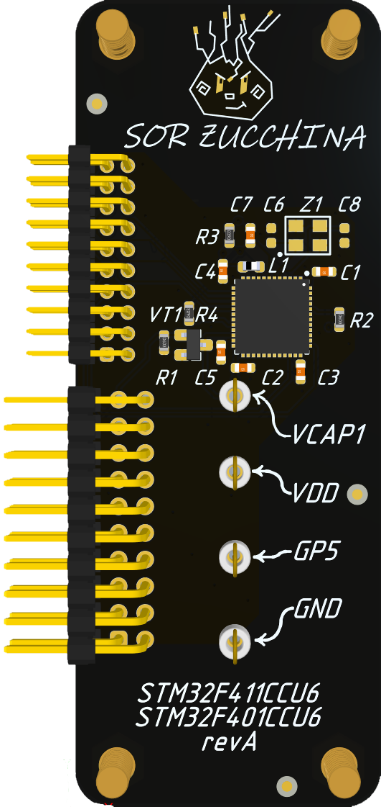

# STM32

## Description 

STM32 microcontrollers have a protection mechanism called **Readout Protection (RDP)**. For more advanced chip versions, it's accurate to say there are three protection levels, where level 0 means no protection.
- **RDP1** – access to flash memory is restricted.    
- **RDP2** – the debug interface is completely disabled.    

It's also typically stated that a chip cannot be returned from RDP2 to a previous state, while it _is_ possible to downgrade from RDP1 — but only with a complete erasure of the flash memory.

### Supported devices

The repository contains a description of attacks on both **RDP1** and **RDP2**. The most detailed analysis is provided for the [STM32F466](#stm32f466) — it is essential to study this one. For all other STM32 series, only timing parameters and oscilloscope waveforms are available.
* [STM32F466](#stm32f466)
* [STM32F401](#stm32f401)
* [STM32F411](#stm32f401)
* ...
* any STM32 - using the universal add-on.
###### Note
All STM32 microcontrollers have a similar protection mechanism, but there are some minor differences. Make sure to read the documentation for your specific MCU.
* STM32F401 ([RM0368 Reference manual](https://www.st.com/resource/en/reference_manual/rm0368-stm32f401xbc-and-stm32f401xde-advanced-armbased-32bit-mcus-stmicroelectronics.pdf))
* STM32F411 ([RM0383 Reference manual](https://www.st.com/resource/en/reference_manual/rm0383-stm32f411xce-advanced-armbased-32bit-mcus-stmicroelectronics.pdf))
* STM32F466 ([RM0390 Reference manual](https://www.st.com/resource/en/reference_manual/rm0390-stm32f446xx-advanced-armbased-32bit-mcus-stmicroelectronics.pdf))

### General commands

In the general case, you can power on an STM32 microcontroller soldered onto the add-on as follows:
```bash
# Power on STM32 (3.3V)
py.exe chipctrl.py -p COM23 -gp 4 1
# Do not pull the microcontroller's Reset pin to ground
py.exe chipctrl.py -p COM23 -gp 3 0

# Switch SWD pins from the microcontroller to the external connector
py.exe chipctrl.py -p COM23 -swd ext
```

After this, the microcontroller on the add-on will be powered on in bootloader mode, and you will be able to connect to it via the external SWD connector on **Chip'olino**, using **J-Link**/**ST-Link** and **STM32CubeProgrammer**. This allows you to set protection levels or view the current one. You can also check the bootloader version on the microcontroller.


### RDP1 
The **RDP1 attack** involves powering on the microcontroller in **bootloader mode** (system memory). Then, an attempt is made to read the flash memory using the standard bootloader command **0x11 (Read Memory)**. This command can be sent via various interfaces — **UART, SPI, I2C, CAN, or USB**.


###### Note
``` Markdown
The supported interfaces of the microcontroller can be found in the AN2606 Application note STM32 microcontroller system memory boot mode.
Support depends not only on the MCU series but also on the version of its bootloader.
```

For the attack, it is necessary to glitch the microcontroller’s core immediately after sending the command. If the protection level is set to **RDP1**, the response to the request will be a **NACK (0x1F)**. The goal is to find the glitch timing and parameters that cause the microcontroller to respond with an **ACK (0x79)** instead.


The most popular power glitch attack method on STM32 involves placing an N-MOSFET transistor on the **Vcap** pin (core power), if it is available. If there are two Vcap pins, you can experiment to see whether it's better to glitch one pin or both simultaneously. Sometimes, the Vcap pin is absent; in that case, the attack is performed on the main MCU power line (3.3V).


For precise timing of the attack, it is best to synchronize directly to the edges on the interface lines. For example, the optimal attack method on the STM32F407 involves starting the timing count from the last edge on the **UART_TX** line. That is, once the read memory command is sent, the timing begins. For other STM32 series, it is more convenient to synchronize to the edges on the **SPI_CLK** line. Synchronizing to SPI provides a more accurate result compared to UART.


### RDP2 
The **RDP2 attack** involves targeting the microcontroller during its initial startup. The attack occurs after the MCU reset and before code execution begins. The approximate attack window on all STM32 devices can be identified using an oscilloscope — a characteristic pattern appears on the power supply line.


You can determine whether the protection has been bypassed by reading the **IDCODE** (via SWD). If after the attack the MCU believes it is not in **RDP2**, the real IDCODE will be read. The actual value depends on the STM32 series. For example, for STM32F4xx, it is **0x2BA01477**. If the protection is still active, the IDCODE cannot be read; for Chip'olino, this will appear as **0xFFFFFFFF**.

The most popular power glitch attack method on STM32 involves installing an N-MOSFET transistor on the **Vcap** pin (core power), if available. If there are two Vcap pins, you can experiment with whether it's better to glitch one pin or both simultaneously. Sometimes, the Vcap pin is absent; in that case, the attack is performed on the MCU's main 3.3V power line. For precise timing of the attack, it is best to synchronize directly to the rising edge of the power supply to the MCU or the Reset signal.


## <span id="stm32f466">STM32F466</span>

<details>
  <summary>Addon STM32F466</summary>
  


</details>

### <span id="spi_way">Bypass RDP1 (SPI way)</span>

The attack on **STM32F466** is best performed with synchronization to the **SPI_CLK** line (if the bootloader supports SPI) at the moment the memory read command is sent. For this, the **PIO state machine** is configured to wait for **24 clock edges** on the SPI_CLK line starting from the beginning of the **0x11 command** transmission. After that, the countdown to the glitch begins. In 24 SPI clock cycles, three bytes are sent from master to slave. The SPI command for the bootloader consists of the bytes: **{0x5A, cmd_byte, cksm_cmd_byte}**. In the case of the Read Memory command, this is: **{0x5A, 0x11, 0xEE}**.

On add-ons where it's possible to synchronize with edges on **SPI**, **UART**, or **CAN**, the corresponding resistor must be soldered in place. For example, for **STM32F466 + SPI**:


#### Glitch MCU

To launch the attack, solder the **STM32F466** onto the add-on **[\pcb\Addons\STM\STM32F446RCT6_revA](\pcb\Addons\STM\STM32F446RCT6_revA)**. Then, run the script:

```bash
py.exe chipctrl.py -p COM23 -g -t stm32f4xx_spi_rdp1 -o 220 260 -w 23 35
```


##### Debug note
```
"Target not synchronized" after starting the attack means that either the add-on is assembled incorrectly, or the protection level is set to RDP2.
```

##### Debug note
```
An occasionally flashing "NACK" message in the Log field during brute-force attempts indicates that the process is running as expected.
```


You can observe and debug the process using an oscilloscope. Below are waveforms of a successful attack. They can be used to examine the timing characteristics of the glitch.


###### Glitch parameters
* ~1 µs from the 24th clock edge of the "Read Memory" command transmission;
* ~100 ns pulse duration;
* Method: N-MOSFET on the **Vcap** core power lines of the MCU;
* Capacitor value: **1 µF**.

#### Dump firmware

The process of extracting firmware from a locked STM32 is quite lengthy. The bootloader command that gets disrupted during the attack allows reading only **0x100 bytes** at a time. One attack attempt isn’t enough—you'll have to repeat the glitch for each subsequent memory chunk. By default, the script **`/scripts/chipctrl.py`** with the **`-g`** argument sends the **GLITCH** command to Chip'olino. For all STM32 devices, the firmware includes the address of the **system memory** (bootloader). So all test runs always attempt to read the first **0x100 bytes** of the bootloader.
##### Attention!
``` Markdown
During a glitch attack on STM32, there is a very high chance of disrupting the operation of the microcontroller’s Flash Memory Controller (FMC). This can lead to data loss in flash memory.
```

To avoid this, you should first fine-tune the attack parameters on a **test microcontroller** and **narrow the brute-force window as much as possible**. Everything described in the **Glitch MCU** section helps with initially identifying the timing and parameters of the attack.

After a successful glitch, you can run the script **chipctrl.py** with the **-dump** argument to view the contents of the buffer containing the data read as a result of the attack.

```bash
# Viewing the data buffer after an STM32 RDP1 attack
py.exe chipctrl.py -p COM23 -dump
```


The **dump** command will display both the contents of the buffer and the memory address from which the data was read. In this case, for the STM32F466, the memory at address **0x1FFF0000** (system memory) was read.

To loop the attack and sequentially read memory, use the script **/scripts/dump_stm32.py**.
##### Note
```
Note how precisely the attack parameters can be tuned when synchronized with SPI.
```

```bash
py.exe .\dump_stm32.py -p COM23 -t stm32f4xx_spi_rdp1 -o 230 232 -w 30 32 -a 0x8000000 0x8000600 -f flash_466.bin
```

When launched this way, Chip'olino will continuously glitch, cycling through both the offset and pulse width until it manages to read a chunk of memory at the initial address. Then the address will increase by 0x100, and the process will repeat. In this case, you need to specify the start and end memory addresses using the **-a** argument, and the file where the read data will be saved using the **-f** argument.


##### Attention!
``` Markdown
You can avoid disrupting the Flash Memory Controller (FMC) by precisely tuning the attack parameters. To do this, you need to run tests on a test MCU beforehand. Solder a test MCU onto the add-on and write any 0x100-byte pattern into its flash memory. Then adjust the attack parameters so that the MCU does **not** get erased.
```

For this kind of testing, there is the script **/scripts/test_erase_stm32.py**.

```bash
py.exe .\test_erase_stm32.py -p COM23 -t stm32f4xx_spi_rdp1 -o 230 232 -w 30 32 -a 0x8000000 -f test466.bin -c cmp_stm401.bin
```

The script continuously attempts to read data from a single address and compares it with the data in the specified file. In this case, a pattern was pre-written to memory at address **0x8000000**:


If the parameters are not set very precisely, a failure will still occur. It looks like this:


Usually, when the FMC fails, the flash is filled with bytes of **0x00**, rather than **0xFF** as with a normal mass erase. Immediately after detecting such a failure, you can connect to the MCU via SWD and check what happened. In the option byte responsible for the RDP value, instead of **0xBB**, it will be **0xFF**. Additionally, the **SRPMOD protection bit** will be set. All this indicates a failure in the flash controller’s operation.

##### Note
```
Use test MCUs. Narrow the brute-force window to a minimum. Find an attack point where the FMC does not fail.
```

##### Note
```
Not all STM32 series experience FMC failures so easily, but on STM32F4xx this problem is quite common. It’s worth noting that sometimes this can be easily avoided by performing the attack over UART instead of SPI, or vice versa.
```

### <span id="uart_way">Bypass RDP1 (UART way)</span>

The attack on **STM32F466** can be performed synchronized to the **UART_TX** line (if the bootloader supports UART) at the moment the memory read command is sent. For this, the **PIO state machine** is configured to wait for **5 edges** on the UART_TX line starting from the beginning of the **0x11 command** transmission. After that, the countdown to the glitch begins. The UART command for the bootloader consists of the bytes **{cmd_byte, cksm_cmd_byte}**. In the case of the Read Memory command, this is: **{0x11, 0xEE}**.

On add-ons where it is possible to synchronize to the edges of SPI, UART, or CAN lines, the corresponding resistor must be soldered. For example, for **STM32F466 + UART**:


#### Glitch MCU

To start the attack, solder the STM32F466 onto the add-on **[\pcb\Addons\STM\STM32F446RCT6_revA](\pcb\Addons\STM\STM32F446RCT6_revA)**. Then run the script:

```bash
py.exe chipctrl.py -p COM23 -g -p COM23 -t stm32f4xx_uart_rdp1 -o 1660 1700 -w 20 30
```


##### Debug note
```
"Target not synchronized" after starting the attack means that either the add-on is assembled incorrectly or the protection level is set to RDP2.
```

##### Debug note
```
An intermittently flashing "NACK" message in the **Log** field during the brute-force process indicates that the process is proceeding normally.
```


You can observe and debug the process using an oscilloscope. Below are waveforms of a successful attack, which show the timing characteristics of the glitch.


###### Glitch parameters
- ~7 µs from the last edge of the "read memory" command transmission;    
- ~100 ns pulse duration;    
- Method: N-MOSFET on the Vcap core power lines of the MCU;    
- Capacitor value: 1 µF.

#### Dump firmware

The process of extracting firmware from a locked STM32 is quite lengthy. The bootloader command disrupted during the attack only allows reading **0x100 bytes** at a time. One attack is not enough—you will have to perform the glitch repeatedly to read each subsequent chunk of memory. By default, the script **/scripts/chipctrl.py** with the **-g** argument sends the **GLITCH** command to Chip'olino. For all STM32 devices, the firmware contains the address of the system memory section (bootloader). Therefore, all test runs always attempt to read the first **0x100 bytes** of the bootloader.

##### Attention!
```
During a glitch attack on STM32, there is a very high chance of disrupting the operation of the MCU's Flash Memory Controller (FMC). This can lead to data loss in the flash memory.
```

To avoid this, you need to fine-tune the attack parameters on a test MCU and narrow the brute-force window to a minimum. Everything described in the **Glitch MCU** chapter helps to initially identify the timing and parameters of the attack.
After a successful glitch, you can run the script **chipctrl.py** with the **-dump** argument to view the contents of the buffer with the data read as a result of the attack.

```bash
# Viewing the data buffer after an STM32 RDP1 attack
py.exe chipctrl.py -p COM23 -dump
```


The **dump** command will display both the contents of the buffer and the memory address from which the data was read. In this case, for the STM32F466, the memory at address **0x1FFF0000** (system memory) was read. To loop the attack and sequentially read memory, use the script **/scripts/dump_stm32.py**.
###### Note
```
Note how precisely the attack parameters can be tuned.
```

```bash
py.exe .\dump_stm32.py -p COM23 -t stm32f4xx_uart_rdp1 -o 1660 1690 -w 23 28 -a 0x8000000 0x8000800 -f test466.bin
```

When launched this way, Chip'olino will continuously glitch, cycling through both the offset and pulse width until it successfully reads a chunk of memory at the initial address. Then the address value will increase by 0x100, and the process will repeat. In this case, you need to specify the start and end memory addresses using the **-a** argument and the file where the read data will be saved using the **-f** argument.


##### Attention!
```
You can avoid FMC failure by precisely tuning the attack parameters. To do this, you first need to run tests on a test MCU. Solder a test MCU onto the add-on, write any 0x100-byte pattern into its flash memory, and adjust the attack parameters so that the MCU does not get erased.
```

There is a script for such testing: **/scripts/test_erase_stm32.py**.

```bash
py.exe .\test_erase_stm32.py -p COM23 -t stm32f4xx_uart_rdp1 -o 1665 1675 -w 24 26 -a 0x8000000 0x8000800 -f test466.bin -c cmp_stm401.bin
```

The script repeatedly tries to read data from a single address and compares it with the data in the specified file. In this case, a pattern was pre-written to memory at address **0x8000000**:


If the parameters are not set precisely enough, a failure will still occur. It looks like this:


Typically, when an FMC failure occurs, the flash memory gets filled with bytes of 0x00 instead of 0xFF, which is what happens during a normal mass erase. Immediately after detecting such a failure, you can connect to the MCU via SWD and check what happened. In the option byte responsible for RDP, the value is no longer 0xBB but 0xFF. Additionally, the SRPMOD protection bit is set. All this indicates a malfunction in the flash controller.

##### Note
```
Use test MCUs. Narrow the brute-force window to a minimum. Find an attack timing where the FMC does not fail.
```

##### Note
```
Not all STM32 series experience FMC failures so easily, but on STM32F4xx this problem is quite pronounced. It’s worth noting that sometimes this can be easily avoided by performing the attack over UART instead of SPI, or vice versa.
```

### Bypass RDP2

#### Glitch MCU

To start the attack, solder the STM32F466 onto the add-on **[\pcb\Addons\STM\STM32F446RCT6_revA](\pcb\Addons\STM\STM32F446RCT6_revA)**. Then run the script:

```bash
py.exe chipctrl.py -p COM23 -g -p COM23 -t stm32f4xx_rdp2 -o 410000 500500 -w 10 50
```


##### Debug note
```
"0xFFFFFFFF" in the Log field after starting the attack means that the SWDIO line is pulled up to 3.3V — this indicates that the add-on is assembled correctly and the MCU is powering on.
```

A successful attack is characterized by a correctly read IDCODE:


You can observe the process and debug it using an oscilloscope. Below are oscilloscope screenshots of a successful attack. They show the timing characteristics of the attack.


###### Glitch parameters
- ~ 45–60 µs from the start of the hardware initialization process;    
- ~ 200 µs from the power-up of the LDO for the MCU core;    
- Pulse duration: ~100 ns;    
- Method: N-MOSFET on the Vcap lines powering the MCU core;    
- Capacitor capacitance: 1 µF.

#### Dump firmware

After a successful attack, the MCU's SWD will still be operational. The MCU will think it is in RDP1 mode. Without disconnecting the add-on from Chip'olino, switch the SWD lines from the MCU to the external connector and connect to it via ST-Link.

```bash
py.exe chipctrl.py -p COM23 -g -p COM23 -swd ext
```

Since the failure results in an error when reading the option bytes, the RDP field in STM32CubeProgrammer will show any value different from 0xCC (RDP2).


This is where it gets really interesting. Despite all the warnings that the MCU cannot be recovered after setting RDP2, it _can_ be restored. **If the goal is to further read the firmware, then by bypassing the RDP2 protection, you need to set it to RDP1 (0xBB); in this case, the flash memory will not be erased.** If the firmware is not needed, you can switch to RDP0 (0xAA), which will erase the chip’s memory and return it to factory state.


After that, the firmware can be extracted as described in the chapter [**Bypass RDP1 (UART way)**](#uart_way) or  [**Bypass RDP1 (SPI way)**](#spi_way)

##### Attention!
```
When attempting to glitch the STM32 operation, it is possible to disrupt the FMC (Flash Memory Controller), which can lead to loss of data in the flash memory. You can avoid FMC failure by precisely tuning the attack parameters. To do this, you first need to run tests on a test MCU. Solder a test MCU onto the add-on, write any 0x100-byte pattern into its flash memory, and adjust the attack parameters so that the MCU does not get erased.
```

##### Note
```
Use test MCUs. Narrow the search window to a minimum. Choose an attack timing where the FMC does not fail. It is also better to reduce the pulse duration to the shortest possible time.
```

## <span id="stm32f401">STM32F401, STM32F411</span>

<details>
  <summary>Addon STM32F401/411</summary>
  



</details>

### Bypass RDP1
#### Glitch MCU
To start the attack, solder the STM32F466 onto the add-on **[\pcb\Addons\STM\STM32F411CCU_revA**](\pcb\Addons\STM\STM32F411CCU_revA)**. Then run the script:

```bash
py.exe chipctrl.py -p COM6 -g -t stm32f4xx_spi_rdp1 -o 220 260 -w 10 23
```


You can observe and debug the process using an oscilloscope. Below are oscilloscope traces of a successful glitch attack. They show the timing characteristics of the attack.


###### Glitch parameters
- ~ 1 µs after the 24th rising edge of the "read memory" command transmission;    
- Pulse duration  ~100 ns;    
- Method: N-MOSFET on the Vcap lines powering the MCU core.

#### Dump firmware

```bash
py.exe .\dump_stm32.py -p COM6 -t stm32f4xx_spi_rdp1 -o 239 240 -w 16 17 -a 0x8000000 0x8000600 -f flash_401.bin
```

```bash
py.exe .\test_erase_stm32.py -p COM6 -t stm32f4xx_spi_rdp1 -o 240 242 -w 17 18 -a 0x8000000 -f test401.bin -c cmp_stm401.bin
```

