# nRF52

<details>
  <summary>Addon NRF52840</summary>
  


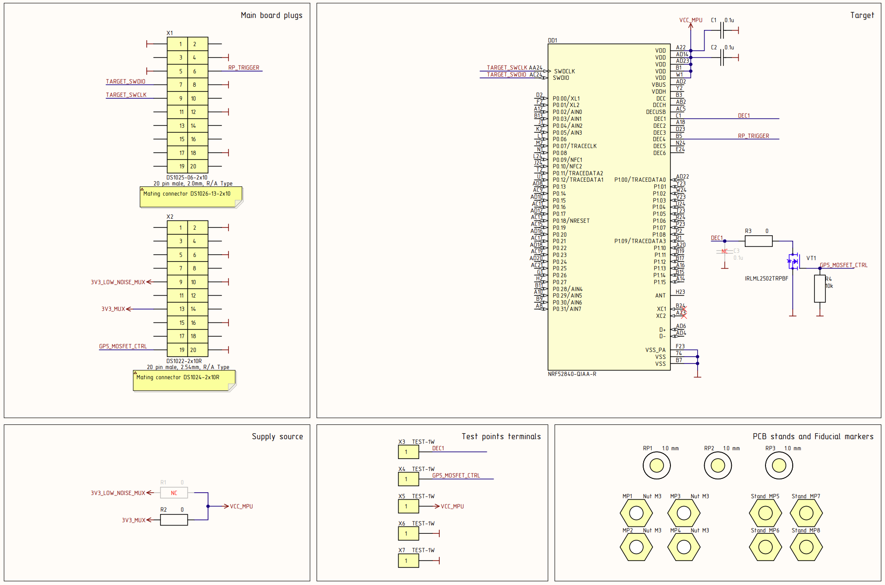

</details>
<details>
  <summary>Addon NRF52833</summary>
  
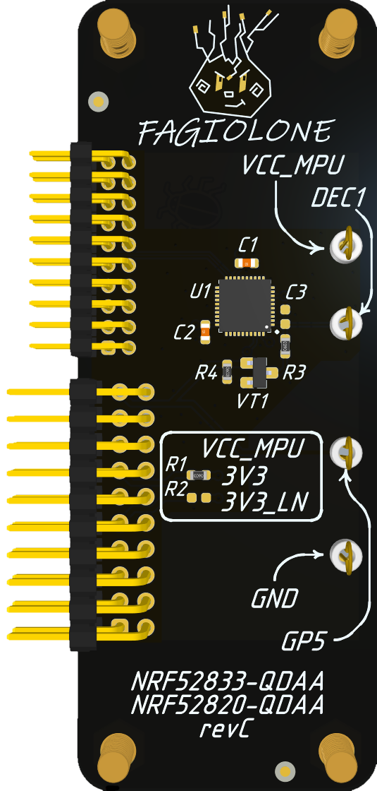

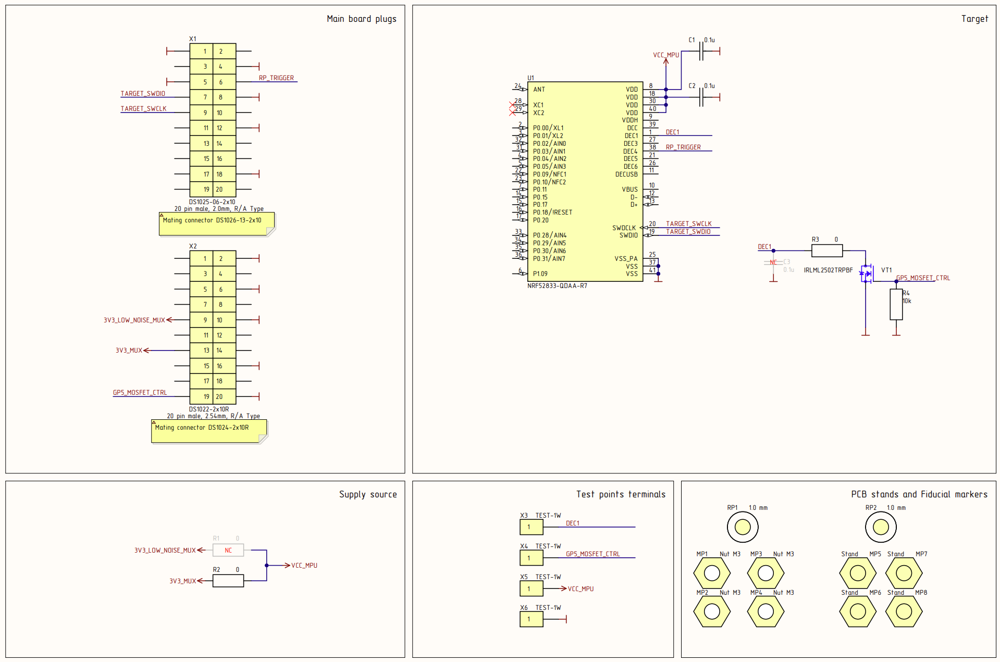

</details>
<details>
  <summary>Addon NRF52832</summary>
  
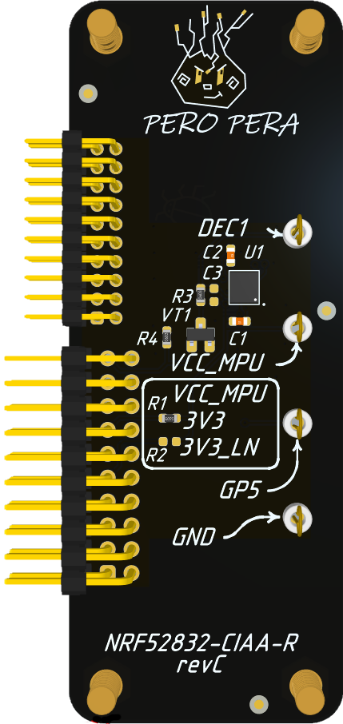

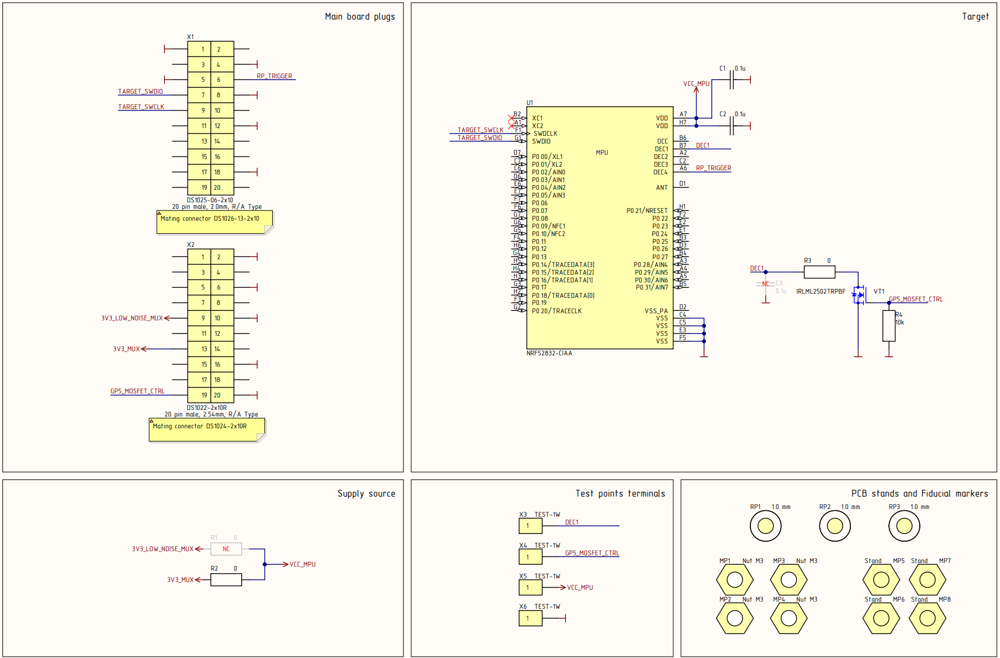

</details>

## Bypass APPROTECT
The entire nRF52 MCU series has a single type of protection: **APPROTECT**, which prevents reading the firmware. When this protection is enabled, access to the MCU via SWD is disabled. The protection is activated when the APPROTECT register is set to 0x00.

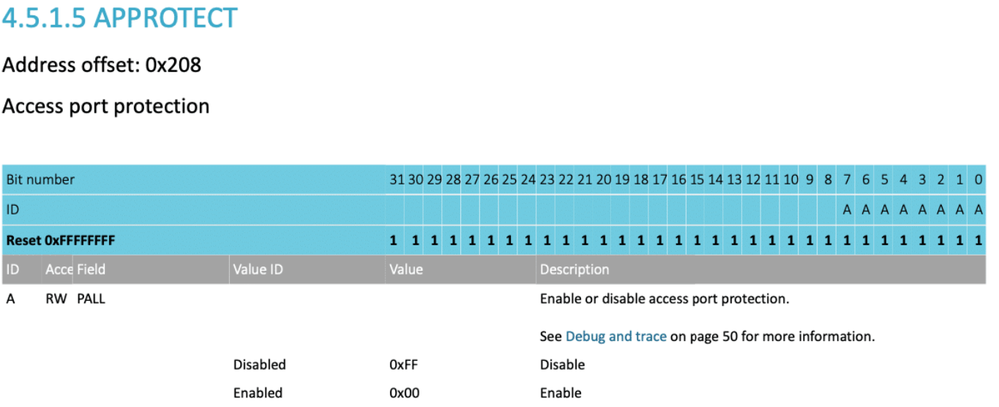
##### Note
```
It’s worth noting that this register is located in non-volatile memory (NVM). Moreover, rewriting this register is unrestricted—as long as you have access via SWD.
```

You can read more details in the original [research](https://limitedresults.com/2020/06/nrf52-debug-resurrection-approtect-bypass/).

For testing, you can solder the nRF52 chip onto the addon without any lock enabled and then activate the protection on it. To do this, power up the microcontroller, then switch the SWD pins to the external connector (by default, they are routed to the Pi Pico on the Chip'olino board). After that, you can connect a J-Link debugger to the powered microcontroller and enable the protection using the **nrfjprog** utility.

```bash
# Power on the nRF52 (3.3V).
py.exe chipctrl.py -p COM5 -gp 4 1

# Switch the SWD pins from the MCU to the external connector
py.exe chipctrl.py -p COM5 -swd ext

# Enable protection on the nRF52
nrfjprog --rbp ALL -f NRF52
```

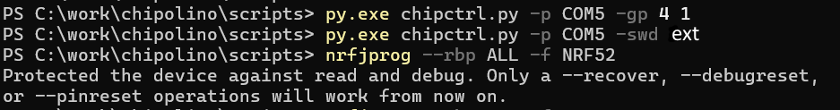


### Glitch MCU
The goal of the attack is the moment of the MCU’s hardware initialization. When power is applied, the MCU checks the value in the APPROTECT register and, depending on it, may disable access via SWD.
##### Attention!
```
It is important to understand that this vulnerability has been fixed by the chip manufacturer. In early chip revisions, the protection was disabled by default.
During hardware initialization (before code execution), the protection was enabled if the APPROTECT register contained the corresponding value.
In newer revisions, the protection is enabled by default.
```

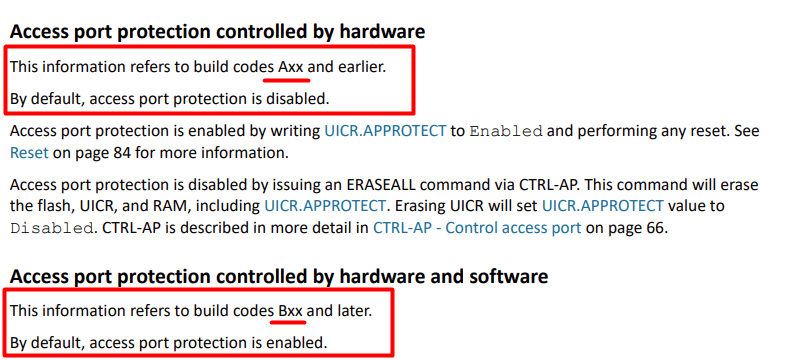

##### Note
```
The hardware revision of the MCU (HW revision) can be identified from the markings on the chip package.
```

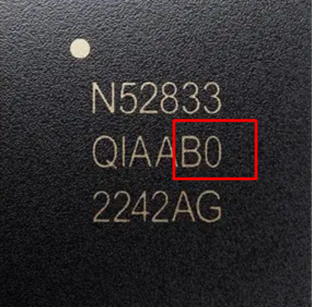

#### Запуск атаки на NRF52
```bash
py.exe chipctrl.py -p COM5 -g -t nrf52 -o 198000 475000 -w 3 30
```

The offset and pulse width values vary significantly depending on the model (for example, nRF52840 or nRF52833) as well as the MCU revision. The screenshot below shows the segment on the DEC1 power line that should be targeted. The signal shape on DEC1 may differ substantially from the example, as MCU revisions have a strong influence. However, this segment can always be located. It consistently lasts about 15 µs and is preceded by a distinctive dip. From that dip to the end of the segment is always just under 20 µs.

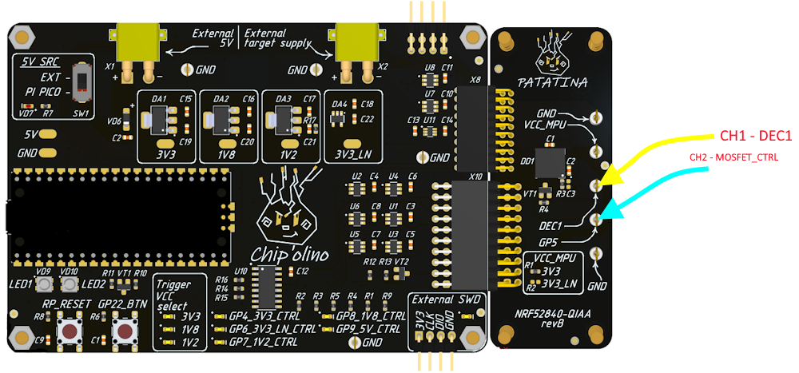
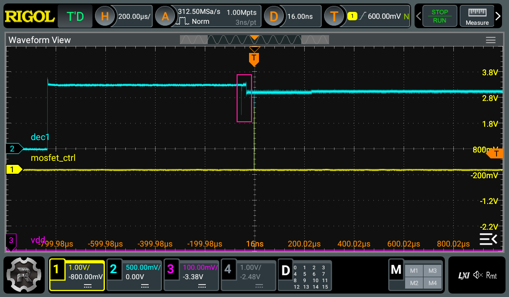
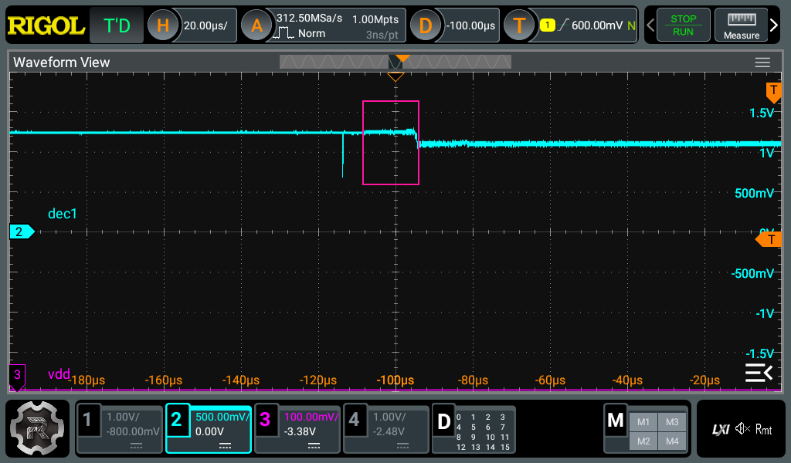
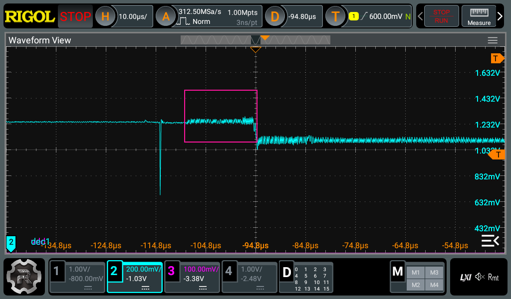

During a successful brute-force attempt, the **Log** field should occasionally display the value **"23000000"**. This value appears when reading the **AHB-AP Identification Register** on a locked MCU. For an unlocked MCU, the value **0x24770011** is read (this applies specifically to nRF52).

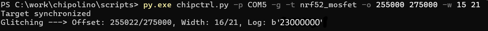

he success of the attack is determined by the read value of the **AHB-AP ID**.

### Dump firmware

After a successful attack, the SWD AP becomes accessible. Then you can use J-Link directly to read out the firmware. Without disconnecting the addon from Chip'olino, switch the SWD pins from the nRF52 to the external connector and connect J-Link to it.

```bash
# Switch the SWD pins from the MCU to the external connector
py.exe chipctrl.py -p COM5 -swd ext
```

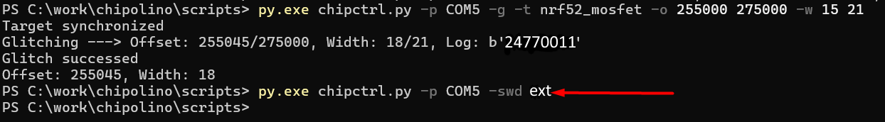

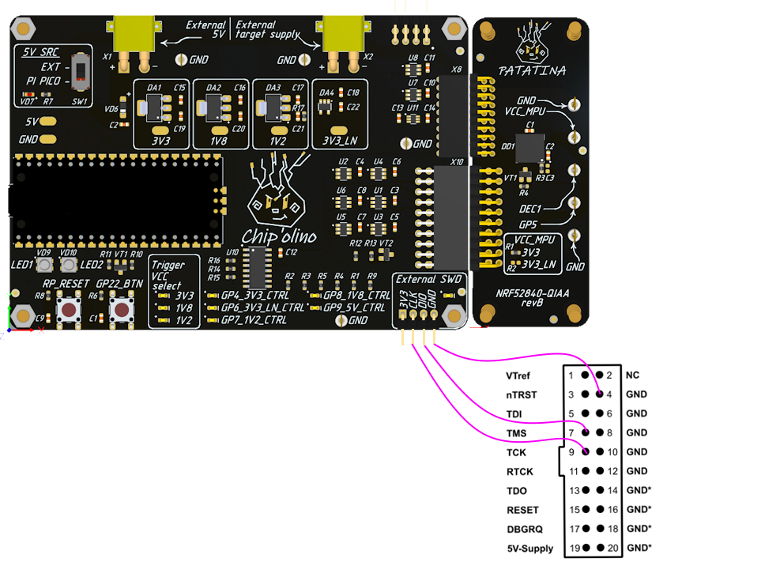

Once J-Link is connected, you can normally read the firmware from the nRF device—for example, using J-Mem.

##### Note
```
Nice bonus: usually, after rebooting the MCU, it gets locked again—but not always. Sometimes the MCU stays unlocked until the next forced lock.
```

### Glitch examples

The nRF52 chips, as mentioned earlier, vary significantly depending on the hardware revision and model. Therefore, below are oscilloscope screenshots for several MCUs in this series — both without glitch and during the glitch moment.
###### nRF52840 rev A0  (QIAA)

```bash
# Launch
py.exe chipctrl.py -p COM5 -g -t nrf52 -o 198300 296000 -w 12 25

# Result
Target synchronized
Glitching ---> Offset: 198695/296000, Width: 18/25, Log: b'24770011'
Glitch successed
Offset: 198695, Width: 18

#
Pulse duration: ~300 ns
```
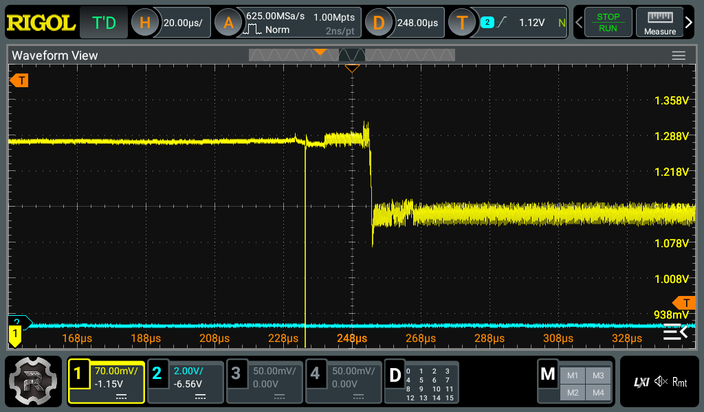
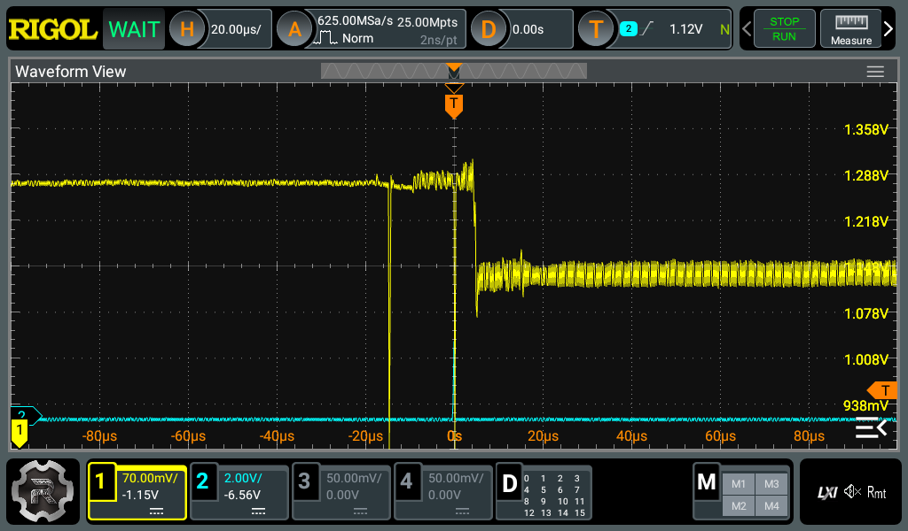
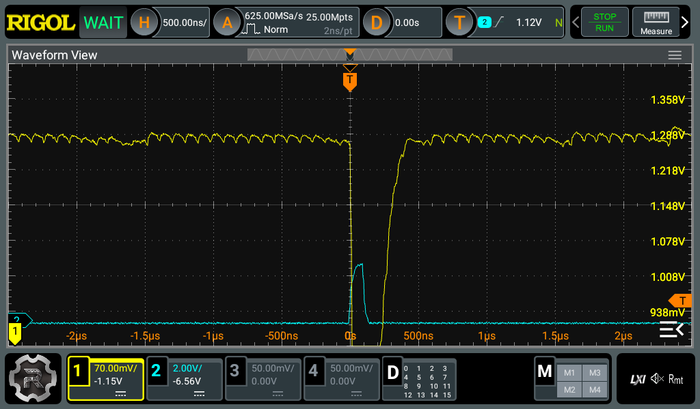

###### nRF52833 rev A0 (QDAA)

```bash
# Launch
py.exe chipctrl.py -p COM5 -g -t nrf52 -o 255000 296000 -w 16 21

# Result
Target synchronized
Glitching ---> Offset: 255067/296000, Width: 19/21, Log: b'24770011'
Glitch successed
Offset: 255067, Width: 19

#
Pulse duration: ~250 nc
```

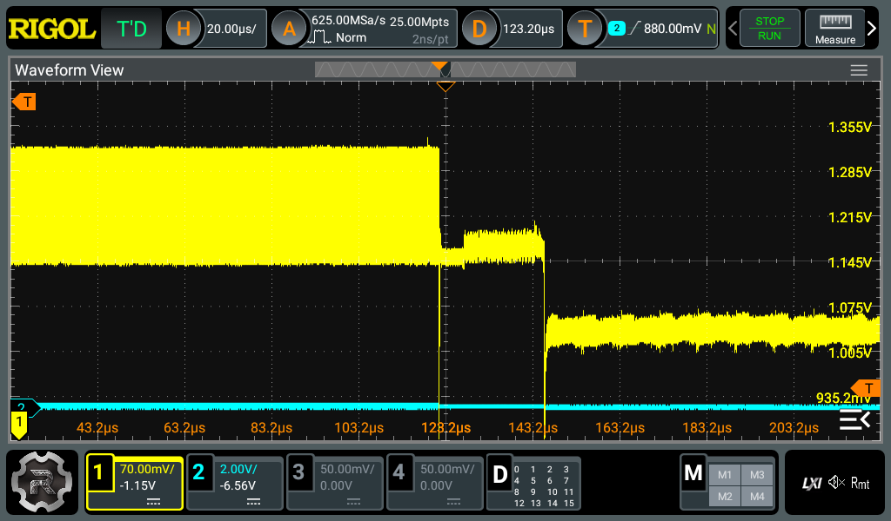
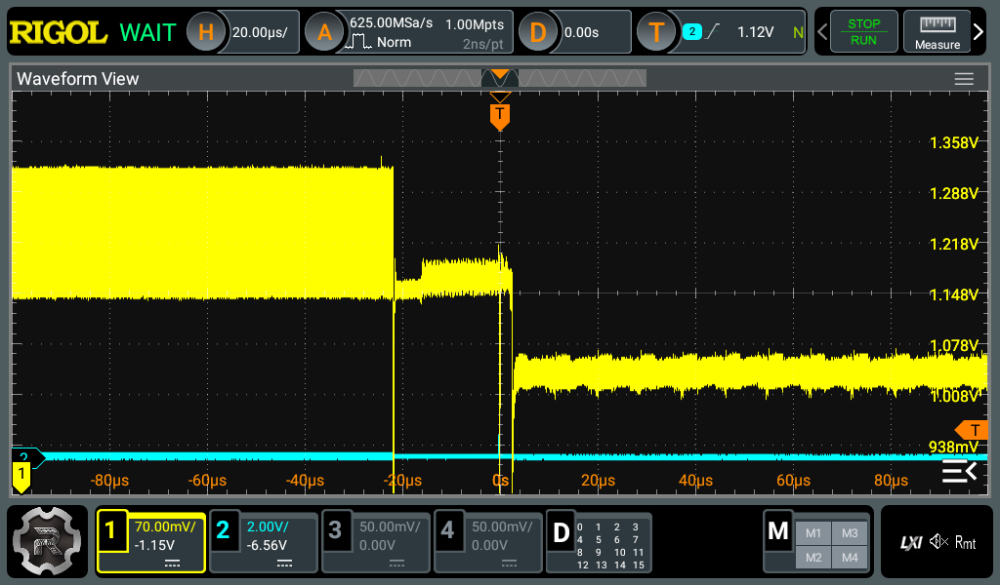
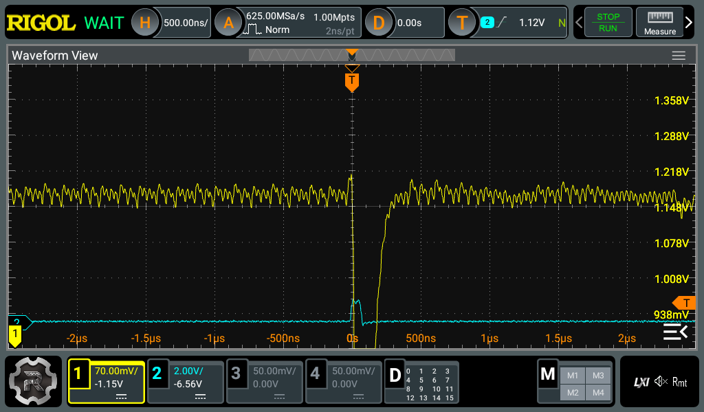

### Links
* https://limitedresults.com/2020/06/nrf52-debug-resurrection-approtect-bypass/


